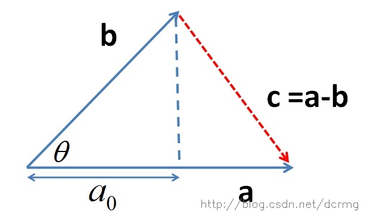
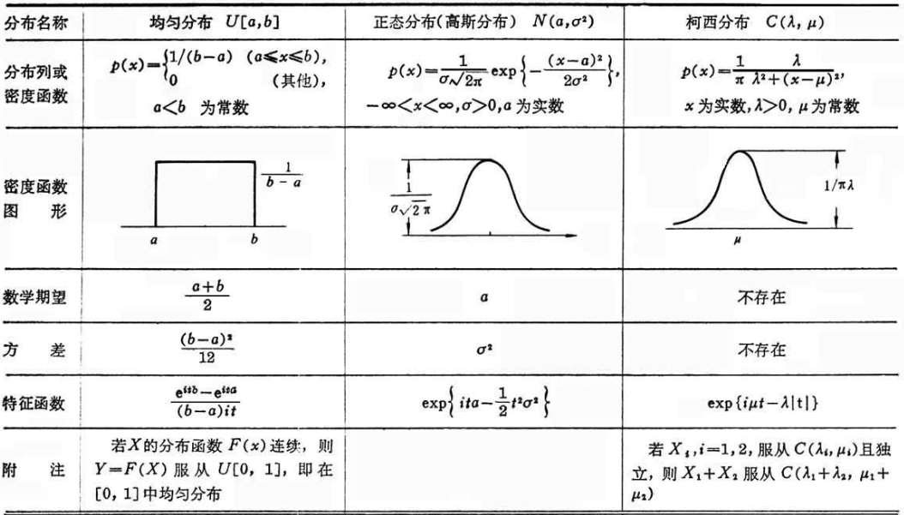
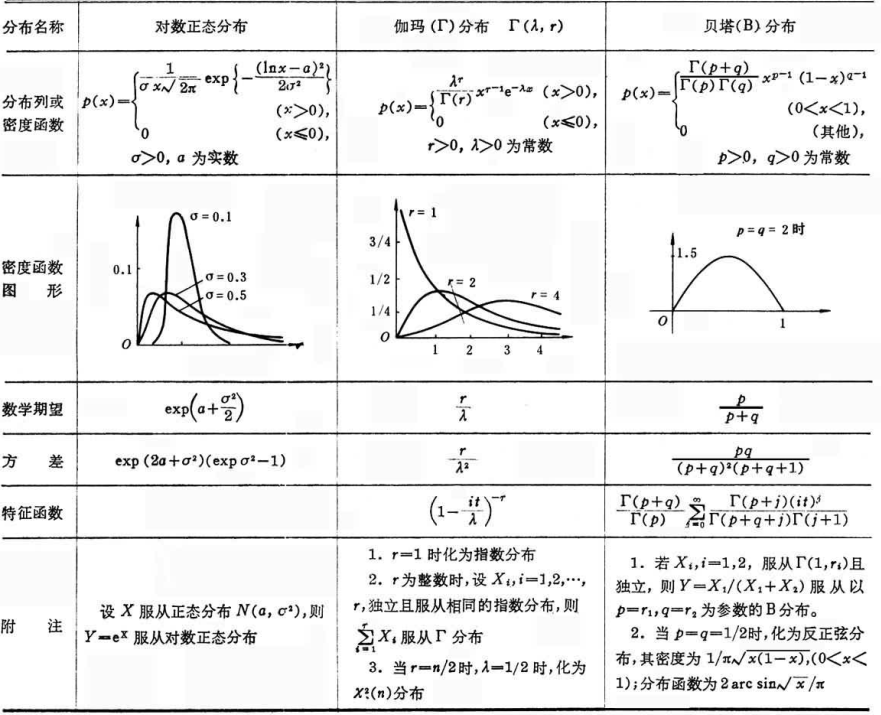
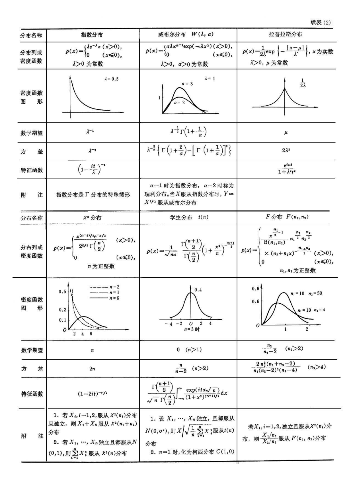

# 数学基础

## 点积与叉积的物理意义

### 点积

内积, 数量积, 结果为标量

向量定义: $c=a-b$

- 两矩阵/向量 对应位一一相乘
- 点积的几何意义是可以用来表征或计算两个向量之间的夹角
  - dot(a, b) > 0 -- 方向相同, 夹角在 0 ~ 90 之间
  - dot(a, b) = 0 -- 正交, 相互垂直
  - dot(a, b) < 0 -- 方向基本相反, 夹角在 90 ~ 180 之间
- b 向量在 a 向量上的投影

### 叉积

外积, 向量积, 结果为向量(法向量)

- 在 3D 图像学, 通过两个向量的叉乘, 生成第三个 **垂直** 于 a, b 的法向量, 从而构建 X/Y/Z 座标系
- 在二维空间, aXb 等于由 向量 a 和向量 b 构成的 平行四边形 的 面积

## 张量与矩阵的区别

- 从代数角度讲, 矩阵是向量的推广
- 从几何角度讲, 矩阵是一个真正的几何量, 也就是, 不随参照系的座标变化而变换的东西
- 张量可以认为是 3X3 的矩阵, 标量是 1X1 的矩阵, 表示矢量的三维数组是 1X3 的矩阵

## 向量和矩阵的范数归纳

### 向量的范数

定义 `a=[-5, 6, 8, -10]`

- 1 范数: 向量的各个元素的 绝对值之和
- 2 范数: 向量的各个元素的 平方和再开平方根
- 负无穷 范数: 向量的所有元素的 绝对值中最小
- 正无穷 范数: 向量的所有元素的 绝对值中最大

### 矩阵的范数

定义 `A=[-1 2 -3; 4 -6 6]`

- 1 范数: 每个 **列** 中各个元素 绝对值求和, 取最大(绝对值列和最大)
- 2 范数: $A^{T}A$的最大特征值开平方根
- 无穷范数: 每个 **行** 中各个元素 绝对值求和, 取最大(绝对值行和最大)
- 核范数: 奇异值(将矩阵 svd 分解)之和, 这个范数可以用来低秩表示(最小化核范数, 相当于最小化矩阵的秩--低秩)
- L0 范数: 非 0 元素的 个数 , 通常用来表示稀疏, **L0 范数越小, 0 元素越多, 越稀疏**
- L1 范数: 每个元素 绝对值之和 , 是 L0 范数的最优凸近似, 因此也可以表示稀疏
- F 范数(L2 范数): 每个元素 平方之和再开平方根 , 由于它是一个凸函数, 可以求导求解, 易于计算
- L21 范数:
  - 以矩阵的每一列为单位, 求一列的 F 范数(可认为是向量的 2 范数), 然后将得到的结果求 L1 范数(可认为是向量的 1 范数)
  - 从中可以看出它是介于 L1 和 L2 之间的一种范数
  
### 如何判断一个矩阵是正定()

1. 顺序主子式大于 0
2. 存在可逆矩阵 $C$ 使 $C^{T}C$ 等于该矩阵
3. 正惯性指数等于 n
4. 合同于单位矩阵 E (规范形为 E)
5. 标准形中主对角元素全为正
6. 特征值全为正
7. 是某基的度量矩阵

### 导数和偏导数有什么区别

导数和偏导数没有本质区别, 都是当自变量的变化趋向于 0 时, 函数值的变化量与自变量变化量 *比值* 的极限(如果极限存在)

### 特征值分解和特征向量

**特征值分解** 可以得到 特征值和特征向量 , 特征值表示这个特征到底有多重要, 而特征向量表示这个特征是什么

如果说一个 向量 $\vec{v}$ 是 方阵 $A$ 的特征向量, 则有:

$$ A\nu=\lambda \nu$$

($\lambda$ 为特征向量; $\nu$ 为对应的特征值)

特征值分解是将一个矩阵分解为如下形式:

$$A=Q \sum Q^{-1}$$

其中:
- $Q$ 是整个矩阵 $A$ 的特征向量组成的矩阵
- $\sum$ 是一个对角矩阵, 每一个对角线元素就是一个特征值, 里面的特征值是由大到小排列的, 这些特征值所对应的特征向量就是描述这个矩阵变化方向
- 因此 -- 矩阵 A 的信息被其 **特征值** 和 **特征向量** 分割, 并由它们近似表示

### 奇异值与特征值有什么关系

定义一个矩阵 $A$, 对 $A^{T}A$ 求特征值, 则有:

$$(A^{T}A)V=\lambda V$$

这里的 $V$ 就是上面的 右奇异向量, 另外:

$$\sigma_i = \sqrt{\lambda_i}, u_i=\frac{1}{\sigma_i}A\mu_i$$

这里的 $sigma$ 就是 奇异值, $u$ 就是 左奇异向量

其中:
- 与奇异值类似, 再矩阵 $\sum$ 中也是从大到小的排列的, 而且 $sigma$ 减少的特别快
- 由于很多情况下, 前 10% 甚至 1% 的奇异值的和就占了全部奇异值之和的 99% 以上, 因此可以用 前 r(r 远小于 m/n) 个的奇异值来近似描述矩阵, 即 部分奇异值分解 :
  - $$A_{m \times n}\thickapprox U_{m \times r}\sum_{r \times r}V_{r \times n}^T$$
  
### 变量和随机变量有什么区别

- **随机变量(random variable)**: 表示随机现象 (在一定条件下), 并不总是出现相同结果的现象称为随机现象, 中各种结果的实值函数(一切可能的样本点)
- 随机变量 与 模糊变量 的不确定性的本质差别在于, 后者的测定结果仍具有 不确定性/模糊性
- 当变量的取值概率不为 1 , 变量就变成随机变量; 当随机变量取值概率为 1 , 随机变量就成为了变量

### 常见的概率分布

### 条件概率

$$P(A/B) = P(A\cap B)/P(B)$$

### 联合概率和边缘概率联系区别

区别:
- 联合概率: 类似于 $P(X=a,Y=b)$ , 包含多个条件, 且同时成立; 多元的概率分布中多个(独立/不独立?)随机变量副本满足各自条件的概率
- 边缘概率: 类似于 $P(X=a)$ 或者 $P(Y=b)$, 某个事件发生的概率, 与其他事件无关, 仅与目标变量相关

联系:
- 知道联合分布可求边缘分布
- 只知道边缘分布, 无法求得联合分布

### 条件概率的链式法则

设 $A,B$ 为两个事件, 且 $P(A)>0$, 则有

$$P(AB) = P(B|A)P(A)$$

推广既得

1. $$P(ABC) = P(C|AB)P(B|A)P(A)$$

2. 若 $P(A_1 A_2 ... A_n) > 0$, $$P(A_1 A_2 ... A_n)=P(A_n|A_1 A_2...A_{n-1})P(A_{n-1}|A_1 A_2...A_{n-2})...P(A_1)$$

### 独立性和条件独立性

#### 独立性

$P(XY)=P(X)P(Y)$, 表示事件 $X$ 和事件 $Y$ 互相独立, 此时给定事件 $Z$, 

$$P(X,Y|Z) \not= P(X|Z) P(Y|Z)$$

事件独立时, *联合概率* 等于 *概率的乘积*

#### 条件独立性

给定 $Z$ 的情况下, $X$ 和 $Y$ 条件独立, 当且仅当 $$X \bot Y|X \iff P(X,Y|Z)=P(X|Z)P(Y|Z)$$

此时 $X$ 和 $Y$ 的关系依赖于 $Z$ , 而不是直接产生

### 期望, 方差, 协方差, 相关系数

#### 期望

- 线性运算: $E(ax+by+c)=aE(x)+bE(y)+c$
- 推广形式: $E(\sum_{k=1}^{n}{a_i x_i+c})=\sum_{k=1}^{n}{a_iE(x_i)x_i+c}$
- 函数期望: 设 $f(x)$ 为 $x$ 的函数, 则 $f(x)$ 的期望为
  - 离散函数: $E(f(x))=\sum_{k=1}^{n}{f(x_k)P(x_k)}$
  - 连续函数: $E(f(x))=\int_{-\infty}^{+\infty}{f(x)p(x)dx}$
  
注意: 
- 函数的期望不等于期望的函数, 即 $E(f(x))\not=f(E(x))$
- 一般的, 乘积的期望不等于期望的乘积

#### 方差

概率论中方差用来度量随机变量和其数学期望(即均值)之间的偏离程度, 方差是一种特殊的期望

$$Var(x)=E((x-E(x))^2)$$

方差性质:
- Var(x)=E(x^2)-(E(x))^2
- 常数的方差为 0
- 方差不满足线性性质
  - $$Var(ax+by)=a^2 Var(x)+b^2 Var(y)+2Cov(x, y)^2$$
- 如果 X 和 Y 互相独立, $Var(ax+by)=Var(x)+Var(y)$

#### 协方差

协方差是衡量两个变量线性相关性强度及变量尺度

两个随机变量的协方差:

$$Cov(x,y)=E((x-E(x)) (y-E(y)))$$

方差是一种特殊的协方差

当 $X=Y$, $Cov(x,y)=Var(x)=Var(y)$

协方差性质:
- 独立变量的协方差为 0
- 协方差计算公式:
  - $$Cov(\sum_{i=1}^{m}{a_i x_i}, \sum_{j=1}^{m}{b_j y_j})=\sum_{i=1}^{m}\sum_{j=1}^{m}a_i b_j Cov(x_i, y_i)$$
- 特殊情况
  - $$Cov(a+bx, c+dy)=bdCov(x,y)$$
  
#### 相关系数

相关系数是研究变量之间线性相关程度的量

两个随机变量的相关系数:

$$Corr(x,y)=\frac{Cov(x,y)}{\sqrt{Var(x)Var(y)}}$$

相关系数的性质:

- 有界性, 相关系数的取值范围是 $[-1,1]$ , 可以看成 **无量纲的协方差**
-
  - 值越接近 1, 说明两个变量正相关性越强
  - 越接近 -1, 说明负相关性越强
  - 为 0, 表示两个变量没有相关性
