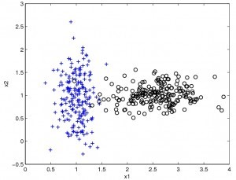
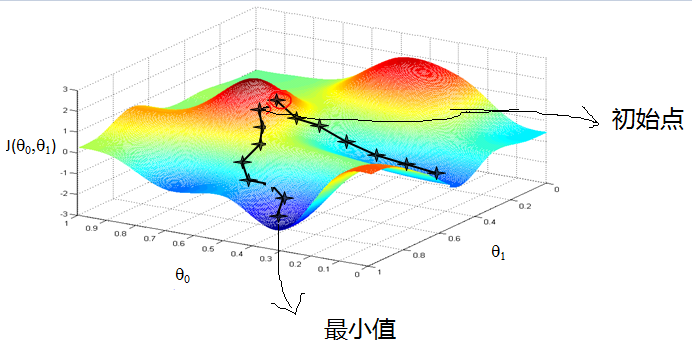

# 机器学习基础

## NOTE: 现况

- 代价函数看不懂
- 损失函数看不懂

## 各种常见算法

| 回归算法           | 基于实例的算法     | 正则化方法         |
| :-:                | :-:                | :-:                |
|  |  |  |
|                    |                    |                    |

| 决策树学习         | 贝叶斯方法         | 基于核的算法       |
| :-:                | :-:                | :-:                |
|  |  |  |
|                    |                    |                    |

| 聚类算法           | 关联规则学习       | 人工神经网络       |
| :-:                | :-:                | :-:                |
|  |  |  |
|                    |                    |                    |

| 深度学习            | 降低维度算法        | 集成算法            |
| :-:                 | :-:                 | :-:                 |
|  |  |  |
|                     |                     |                     |

## 监督学习, 非监督学习, 半监督学习, 弱监督学习

机器学习主要分为以下四种学习方式

**监督学习**:
- 使用已知正确答案的示例来训练网络: 已知数据和其一一对应的标签, 训练一个智能算法, 将输入数据映射到标签的过程
- 常见应用场景: 分类问题 / 回归问题
- 常见算法: 逻辑回归(Logistic Regression) 和 反向传递神经网络(Back Propagation Neural Network)

**非监督学习**:
- 数据不被特别标识, 适用于具有数据集但无标签的情况; 学习模型是为了推断出数据的一些(未知的)内在结构
- 常见应用场景: 关联规则的学习, 聚类
- 常见算法: Apriori 算法 / k-Means 算法

**半监督学习**:
- 输入数据部分被标记, 部分不被标记, 这种方式主要用于预测
- 常见应用场景, 算法包括一些对常用监督式学习的延伸, 通过对已标记的数据建模, 在此基础上, 对未标记的数据进行预测
- 常见算法: 图论推理算法(Graph Inference) 或者 拉普拉斯支持向量(Laplacian SVM)

**半监督学习**:
- 可以看作是有多个标记的数据集合, 次集合可以是空集, 单个元素, 或包含多种情况(没有标记/一个标记/多个标记)的多个元素
- 数据集的标签是 **不可靠** 的, 例如 标记不正确, 多种标记, 标记不充分, 局部标记
- 已知数据和其一一对应的弱标签, 训练一个智能算法, 将输入数据映射到一组更强的标签的过程(标签强弱 一般指代标签蕴含信息量的多少)

- 企业数据应用场景, 常用监督式学习和非监督式学习的模型
- 图像识别的领域, 由于存在大量非标识数据和少量的可标识数据, 半监督学习是一个热门话题

## 常用分类算法的优缺点

| 算法                         | 优点                                                    | 缺点                                                              |
| :-:                          | :-                                                      | :-                                                                |
| Beyes 贝叶斯分类法           | 1. 所需估计的参数少, 对于缺失数据不敏感;                | 1. 假设属性间互相独立, 条件过于特殊                               |
|                              | 2. 有着坚实的数学基础, 稳定的分类效率                   | 2. 需要知道先验概率                                               |
|                              |                                                         | 3. 分类决策存在错误率                                             |
|                              |                                                         |                                                                   |
| Decision Tree 决策树         | 1. 对领域知识或者参数假设需求小                         | 1. 在样本数量不一致的情况下, 数据增益偏向于那些具有更多数值的特征 |
|                              | 2. 适合高维数据                                         | 2. 容易过拟合                                                     |
|                              | 3. 简单易于理解                                         | 3. 忽略属性之间的相关性                                           |
|                              | 4. 短时间能处理大量数据, 得到可行且效果较好的结果       | 4. 不支持在线学习                                                 |
|                              | 5. 能够同时处理数据性和常规性数据                       |                                                                   |
|                              |                                                         |                                                                   |
| SVM 支持向量树               | 1. 可以解决小样本下机器学习的问题                       | 1. 对缺失数据敏感                                                 |
|                              | 2. 提高泛化性能                                         | 2. 内存消耗大                                                     |
|                              | 3. 可以解决高维/非线性问题                              | 3. 调参繁琐                                                       |
|                              | 4. 避免神经网络结构选择和局部极小的问题                 |                                                                   |
|                              |                                                         |                                                                   |
| KNN K 近邻                   | 1. 思想简单, 理论成熟, 既可以用来做分类也可以用来做回归 | 1. 计算量大                                                       |
|                              | 2. 可用于解决非线性问题                                 | 2. 对于样本分类不均匀的问题, 会产生误判                           |
|                              | 3. 训练时间复杂度为 O(N)                                | 3. 内存消耗大                                                     |
|                              | 4. 准确度高, 读数据没有假设, 对 outlier 不敏感          | 4. 输出的可解释性不强                                             |
|                              |                                                         |                                                                   |
| Logistic Regression 逻辑回归 | 1. 速度快                                               | 特征处理复杂, 需要归一化和较多的特征工程                          |
|                              | 2. 简单易于理解, 可看到各个特征的权重                   |                                                                   |
|                              | 3. 能容易的更新模型, 吸收新的数据                       |                                                                   |
|                              | 4. 能动态調整分类阈值                                   |                                                                   |
|                              |                                                         |                                                                   |
| Neural Network 神经网络      | 1. 分类准确性高                                         | 1. 需要大量参数(网络拓扑, 阈值)                                   |
|                              | 2. 并行处理能力强                                       | 2. 结果可解释性弱                                                 |
|                              | 3. 分布式存储和学习能力强                               | 3. 训练时间长                                                     |
|                              | 4. 鲁棒性强                                             |                                                                   |
|                              |                                                         |                                                                   |
| Adaboosting                  | 1. 精度高                                               | 对 outlier 比较敏感                                               |
|                              | 2. 可以使用多种子分类器                                 |                                                                   |
|                              | 3. 当使用简单分类器时, 计算出的结果时可以理解的         |                                                                   |
|                              | 4. 简单, 不用做特征筛选                                 |                                                                   |
|                              | 5. 不用担心 overfitting                                 |                                                                   |
|                              |                                                         |                                                                   |

## 分类算法的评估方法

### 常用术语

- True Poistives(TP): 实际为 正例, 且被划分到 正例 的样本数
- False Positives(FP): 实际为 正例, 且被划分到 负例 的样本数
- False Negatives(FN): 实际为 负例, 且被划分到 正例 的样本数
- True Negatives(TN): 实际为 负例, 且被划分到 负例 的样本数

解释:
- P=TP+FN 表示实际为正例的样本个数
- True, False 描述得是分类器是否判断正确
- Positive, Negative 是分类器的分类结果; 假设 正例===1 负例===-1 positive===1 negative===-1 1===True -1===False
- 假设 True Positive(TP)的实际类标=1*1=1 为正例
  - False Positive(FP) = (-1)*1 = -1
  - False Negative(FN) = (-1)*(-1) = 1
  - True Negative(TN) = 1*(-1) = -1

评价指标
- 正确数(accuracy): 正确率 -- accurarcy = (TP + TN)/(P + N)
- 错误率(error-rate): 错误率则与正确率相反, 描述被分类器错分的比例 -- error-rate = (FP + FN)/(P + N) = 1 - accuracy
- 灵敏度(sensitive): 衡量分类器对正例的识别能力 -- sensitive = TP/P
- 特效度(specificity): 衡量分类器对负例的识别能力 -- specificity = TN/N
- 精度(precision): 精确度的度量 -- precision = TP/(TP+FP)
- 召回率(recall): 覆盖面的度量 -- recall = TP/(TP+FN) = TP/P = sensitive
- 其他
  - 计算速度
  - 鲁棒性
  - 可扩展性
  - 可解释性 -- 分类器的预测标准的可解释性
- 查确率和查全率
  - 综合分类率 F1 -- $F1=\frac{2 \times precision \times recall}{precision + recall}$
  - 宏平均 F1
    - 先对每个类别单独计算 F1 , 再取这些 F1 值的算数凭据数
    - 平等对待每一个类型
    - 主要受到稀有类别的影响
  - 微平均 F1
    - 先累加计算各个类别的 a/b/c/d(??) 的值, 再由这些值求出 F1
    - 平等考虑文档集中的每一个 **文档**
    - 受常见类别的影响较大

**ROC 曲线和 PR 曲线**

## 局部最优和全局最优

- 局部最优: 函数值空间的一个 有限区域 需找最小值
- 全局最优: 函数值空间 整个区域 需找最小值
- 函数局部执行的是小于或等于 附近 的点; 但是有可能大于较远距离的点
- 全局最小点必须小于或等于 所有 的可能点

## 逻辑回归

回归划分: 广义线性模型家族里, 根据因变量不同, 有:
- 如果是 **连续** 的, 就是 **多重线性回归**
- 如果是 **二项分布** , 就是 **Logistic 回归**
- 如果是 **Poisson 分布** , 就是 **Poisson 回归**
- 如果是 **负二项分布**, 就是 **负二项回归**

Logistic 回归 的因变量可以是 二分类, 也可以是 多分类

Logistic 回归的适用性
- 概率预测
- 分类
- 线性问题
- 各特征之间不需要满足条件独立假设, 但各个特征的贡献独立计算

## 逻辑回归和朴素贝叶斯

- 逻辑回归 是生成模型, 朴素贝叶斯 是判别模型, 即 生成 和 判别 的所有区别它们都有
- 朴素贝叶斯属于 贝叶斯, 逻辑回归是 最大似然, 两种概率哲学间的区别
- 朴素贝叶斯属于独立假设
- 逻辑回归需要特征参数间是 线性 的

## 代价函数

- 为了得到训练逻辑回归模型的 *参数* , 需要一个代价函数, 通过训练 代价函数 来得到参数
- 用于找到 最优解 的 目的函数

### 作用原理

常用 平方误差代价函数 求得最优解

$$h(x)=A+Bx$$

通过将实际数据给出的值与拟合出的线的对应值做差, 求出拟合出的直线与实际的差距;
子实际应用中, 为了避免因个别极端数据产生的影响, 采用类似方差再取二分之一的方式来减少个别数据的影响, 代价函数:

$$J(\theta_0, \theta_1) = \frac{1}{m}\sum_{i=1}^m(h(x^{(i)})-y^{(i)})^2$$

此时 最优解 即为 代价函数的最小值 -- $min J(\theta_0, \theta_1)$

- 目标函数需要一个 下界
- 如果优化算法能使目标函数不断减少, 根据单调有界准则, 该优化算法就能证明使收敛有效的
- 即若目标函数有下界, 都可以, 只是 代价函数非负更方便

### 常见代价函数

- 二次代价函数适合输出神经元是 **线性** 的情况, 交叉熵代价函数适合输出神经元是 **S 性函数** 的情况

#### 二次代价函数

$$J=\frac{1}{2n}\sum_x\Vert y(x)-a^L(x)\Vert^2$$

- $J$: 代价函数; $x$: 样本; $y$: 实际值; $a$: 输出值; $n$: 样本总数

如果使用梯度下降法(Gradient descent)调整权值参数的大小, 权值 $w$ 和偏置 $b$ 的梯度如下:

$$\frac {\delta J}{\delta w}=(a-y)\delta'(z)x$$

$$\frac {\delta J}{\delta b}=(a-y)\delta'(z)$$

其中:
- $z$ 表示神经元输入, $\theta$ 表示激活函数
- 权值 $w$ 和 偏置 $b$ 的 梯度 和激活函数的 梯度 成正比

**注**: 神经网络常用的激活函数为 sigmoid 函数, 该函数曲线如下:

- 假设目标收敛到 1.0
  - 0.82 离目标比较远, 梯度比较大, 权值调整比较大
  - 0.98 离目标比较近, 梯度比较小, 权值调整比较小
  - 调整方案合理
- 假设目标收敛到 0.0
  - 0.82 离目标比较近, 梯度比较大, 权值调整比较大
  - 0.98 离目标比较近, 梯度比较小, 权值调整比较小
  - 调整方案不合理
- 原因: 初始的代价(误差)越大, 导致训练越慢

#### 交叉熵代价函数

$$J=\frac{1}{n}\sum_x[y\ln a+(1-y)\ln{(1-a)}]$$

- $J$: 代价函数; $x$: 样本; $y$: 实际值; $a$: 输出值; $n$: 样本总数

权值 $w$ 和偏置 $b$ 的梯度如下:

$$\frac {\delta J}{\delta w_j}=\frac{1}{n}\sum_{x}(\delta{(a)}-y)$$

$$\frac {\delta J}{\delta b}  =\frac{1}{n}\sum_{x}(\delta{(z)}-y)$$

其中:
- j -- ??
- 权值 $w$ 和 偏置 $b$ 的 梯度 和激活函数的 梯度 成正比

#### 对数释然代价函数

softmax 回归的代价函数, 深度学习中一般将 softmax 作为最后一层, 此时常用的代价函数是 对数释然代价函数

对数释然代价函数在 二分类时可以花间为交叉熵代价函数的形式

在 tensorflow 中:
- 与 **sigmoid** 搭配使用的交叉熵函数: tf.nn.sigmoid_cross_cntropy_with_logits
- 与 **softmax** 搭配使用的交叉熵函数: tf.nn.softmax_cross_cntropy_with_logits

### 交叉熵代替二次代价函数

- 二次方代价函数, 偏函数受激活函数的导数影响, sigmoid 函数导数在输出接近 0 和 1 时非常小, 会导致一些实例在刚开始训练时学习的非常慢
- 权重学习的速度受到 $\delta{(z)}-y$ 影响, 更大的误差, 就有更快的学习速度, 避免了二次代价函数方程中因 $\delta'{(z)}$ 导致的学习缓慢

### 损失函数 -- 误差函数 -- $L(Y, f(x))$

评估模型的 预测值 f(x) 与真实值 Y 的 不一致程度, 是一个 非负实值函数

损失函数时经验风险函数的核心部分, 也是结构风险函数重要组成部分

> 结构风险 -- 结构的通用性
> 经验风险 -- 结构对现有数据的拟合效果

### 常见的损失函数

- 经验风险损失函数 -- 预测结果和实际结果的差别
- 结构风险损失函数 -- 经验风险函数 + 正则项

#### 0-1 损失函数

$$L(Y, f(x)) = \begin{cases} 1,& Y \ne f(x)\ 0,& Y = f(x) \end{cases}$$

#### 绝对值损失函数

$$L(Y, f(x))=|Y-f(x)|$$

#### 平方损失函数

$$L(Y, f(x))=\sum_N{(Y-f(x))}^2$$

从最小二乘法和欧几里得距离角度理解 -- 最优拟合曲线应该使所有点到回归直线的 距离和 最小

#### log 对数损失函数

$$L(Y, P(Y|X))=-\log{P(Y|X)}$$

- 逻辑回归常用对数损失函数
- 逻辑回归假设样本服从 伯努利分布(两点分布) , 进而求得满足该分布的似然函数, 乃至 取对数求机制
- 逻辑回归推导出的 经验风险函数 是 最小化负的似然函数, 即 log 损失函数

#### 指数损失函数

$$L(Y|f(x))=exp[-yf(x)]$$

AdaBoost 就是以指数损失函数为损失函数

#### Hinge 损失函数

$$L(y)=max(0, 1-ty)$$

$y$ - 预测值 -- 范围:(-1, 1); $t$ - 目标值 -- -1 OR 1

在线性支持向量机中, 最优化问题等价于

$$\underset{\min}{w,b}\sum_{i=1}^N (1-y_i(wx_i+b))+\lambda\Vert w^2\Vert$$

上式相似于下式

$$\frac{1}{m}\sum_{i=1}^{N}l(wx_i+by_i) + \Vert w^2\Vert$$

其中:
- $l(wx_{i} + by_{i})$ 是 Hinge 损失函数
- $||w^2||$ 可看作正则化项

### 逻辑回归 -- 对数损失函数

假设 逻辑回归模型:

$$P(y=1|x;0)=1/(1+e^{-\theta^{T}x})$$

假设逻辑回归模型的概率分布是 伯努利分布, 其 概率质量函数:

$$P(X=n)=\begin{cases}1-p,n=0 p,n=1 \end{cases}$$

其 似然函数:

$$L(\theta)=prod_{i=1}^{m}P(y=1|x_{i})^y_{i}P(y=0|x_{i})^y_{i}$$

其对数似然:
$$ln L(\thera)
=sum_{i=1}^{m}[y_{i}ln P(y=1|x_{i})+(1-y_{i})ln P(y=0|x_{i})]
=sum_{i=1}^{m}[y_{i}ln P(y=1|x_{i})+(1-y_{i})ln(1-P(y=1|x_{i}))]$$

对数函数在单个数据点上的定义为:

cost(y, p(y|x))=-ylnp(y|x)-(1-y)ln(1-p(y|x))

则全局样本损失函数为:

$$cost(y, p(y|x))=-\sum_{i=1}^{m}[y_{i}ln p(y_{i}|x_{i}) - (1-y_{i})ln(1-p(y_{i}|x_{i})]$$

由此看出, **对数损失函数 与 极大值似然函数估计的对数似然函数 本质上是相同的**, 所以逻辑回归直接采用对数损失函数

### 机器学习与梯度下降

- 梯度下降是迭代法的一种, 可以用于求解最小二乘问题
- 在求解机器学习算法的模型参数, 即无约束优化问题, 主要由 梯度下降法(Gradient Descent) 和 最小二乘法
- 在求解损失函数的最小值时, 可以通过梯度下降法来一步步迭代求解, 得到 最小化的损失函数 和 模型参数值
- 在求解损失函数的最大值时, 可通过梯度上升法来迭代; 梯度下降法和梯度上升法可互相转换
- 在机器学习中, 梯度下降法主要有 随机梯度下降 和 批量梯度下降

#### 梯度下降法缺点

- 靠近极(小)值时收敛速度慢
- 可能会以 "之" 字形的下降

- 梯度时一个向量, 有方向有大小
- 梯度的方向是最大方向导数的方向
- 梯度的值是最大方向导数的值

#### 梯度下降

#### 梯度下降调优

##### 步长 $\alpha$

##### 初始值选择

##### 归一化/标准化处理

样本不同特征的取值范围不一样, 导致迭代慢

归一化:

$$\frac{x-\{期望}x}{std(x)}$$

#### 梯度下降法

##### 批量梯度下降法(Batch Gradient Descent)

使用所有的样本求梯度

$$\thera_{i}=thera_{i} - \alpha \sum_{j=0}^{m}(h_{\thera}(x_{0}^{j}, x_{1}^{j}, ..., x_{n}^{j}) - y_{j})x_{i}$$

##### 随机批量下降法(Stochastic Grandient Descent)

随机选取一个样本求梯度

$$\thera_{i}=thera_{i} - \alpha{j=0}^{m}(h_{\thera}(x_{0}^{j}, x_{1}^{j}, ..., x_{n}^{j}) - y_{j})x_{i}$$

##### 小批量梯度下降法(Mini-batch Gradient Descent)

选取(如何选取?)部分样本求梯度

$$\thera_{i}=thera_{i} - \alpha \sum_{j=t}^{t+x-1}(h_{\thera}(x_{0}^{j}, x_{1}^{j}, ..., x_{n}^{j}) - y_{j})x_{i}$$

#### 梯度下降和其他无约束优化算法

##### 相比于最小二乘法

- 梯度下降法是 迭代求解, 最小二乘法是 计算解析解
- 计算量中小规模: 且存在 解析解, 最小二乘法比梯度下降有优势, 计算速度很快
- 样本量大: 用最小二乘法需要求一个超级大的逆矩阵

##### 相比于牛顿法/拟牛顿法

- 两者都是 迭代求解
- 梯度下降法是 梯度求解, 牛顿是 二阶的海森矩阵的逆矩阵和伪逆矩阵 求解
- 牛顿法/拟牛顿法收敛更快, 但是 每次迭代时间都比梯度下降法长

#### 随机梯度(Stochastic Gradient Descent)和批量梯度(Batch Gradient Descent)

TODO:

#### 各种梯度下降法性能比较

随机梯度下降(SGD), 批量梯度下降(BGD), 小批量梯度下降(mini-batch GD) 和 online GD

|                | BGD        | SGD      | Mini-batch GD | Online GD      |
| :-:            | :-:        | :-:      | :-:           | :-:            |
| 训练集         | 固定       | 固定     | 固定          | 实时更新       |
| 单次迭代样本数 | 整个训练集 | 单个样本 | 训练集的子集  | 根据具体算法定 |
| 算法复杂度     | 高         | 低       | 一般          | 低             |
| 时效性         | 低         | 一般     | 一般          | 高             |
| 收敛速度       | 稳定       | 不稳定   | 较稳定        | 不稳定         |

##### Online GD

- 相对于 Mini-batch GD, SGD
  - Online GD 所有的训练集只用一次, 然后丢弃
  - 可预测最终模型的 *变化趋势*
- 相对于 BGD
  - BGD 每次都需要对历史数据重新训练
  - BGD 无法反馈用户的点击行为迁移
