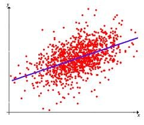
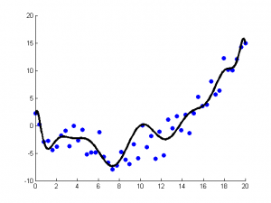
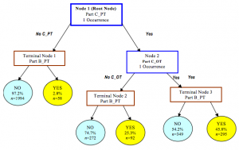
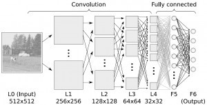
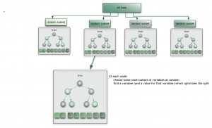

# 机器学习基础

## 各种常见算法

| 回归算法       | 基于实例的算法 | 正则化方法     |
| :-:            | :-:            | :-:            |
|  |  |  |

| 决策树学习     | 贝叶斯方法     | 基于核的算法   |
| :-:            | :-:            | :-:            |
|  |  |  |

| 聚类算法       | 关联规则学习   | 人工神经网络   |
| :-:            | :-:            | :-:            |
|  |  |  |

| 深度学习        | 降低维度算法    | 集成算法        |
| :-:             | :-:             | :-:             |
|  |  |  |

## 监督学习, 非监督学习, 半监督学习, 弱监督学习

机器学习主要分为以下四种学习方式

**监督学习**:
- 使用已知正确答案的示例来训练网络: 已知数据和其一一对应的标签, 训练一个智能算法, 将输入数据映射到标签的过程
- 常见应用场景: 分类问题 / 回归问题
- 常见算法: 逻辑回归(Logistic Regression) 和 反向传递神经网络(Back Propagation Neural Network) 

**非监督学习**:
- 数据不被特别标识, 适用于具有数据集但无标签的情况; 学习模型是为了推断出数据的一些(未知的)内在结构
- 常见应用场景: 关联规则的学习, 聚类
- 常见算法: Apriori 算法 / k-Means 算法

**半监督学习**:
- 输入数据部分被标记, 部分不被标记, 这种方式主要用于预测
- 常见应用场景, 算法包括一些对常用监督式学习的延伸, 通过对已标记的数据建模, 在此基础上, 对未标记的数据进行预测
- 常见算法: 图论推理算法(Graph Inference) 或者 拉普拉斯支持向量(Laplacian SVM)

**半监督学习**:
- 可以看作是有多个标记的数据集合, 次集合可以是空集, 单个元素, 或包含多种情况(没有标记/一个标记/多个标记)的多个元素
- 数据集的标签是 **不可靠** 的, 例如 标记不正确, 多种标记, 标记不充分, 局部标记
- 已知数据和其一一对应的弱标签, 训练一个智能算法, 将输入数据映射到一组更强的标签的过程(标签强弱 一般指代标签蕴含信息量的多少)

- 企业数据应用场景, 常用监督式学习和非监督式学习的模型
- 图像识别的领域, 由于存在大量非标识数据和少量的可标识数据, 半监督学习是一个热门话题

## 常用分类算法的优缺点

| 算法                         | 优点 | 缺点 |
| :-:                          | :-:  | :-:  |
| Beyes 贝叶斯分类法           |      |      |
| Decision Tree 决策树         |      |      |
| SVM 支持向量树               |      |      |
| KNN K 近邻                   |      |      |
| Logistic Regression 逻辑回归 |      |      |
| Neural Network 神经万罗      |      |      |
| Adaboosting                  |      |      |
