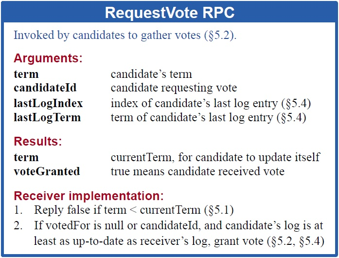
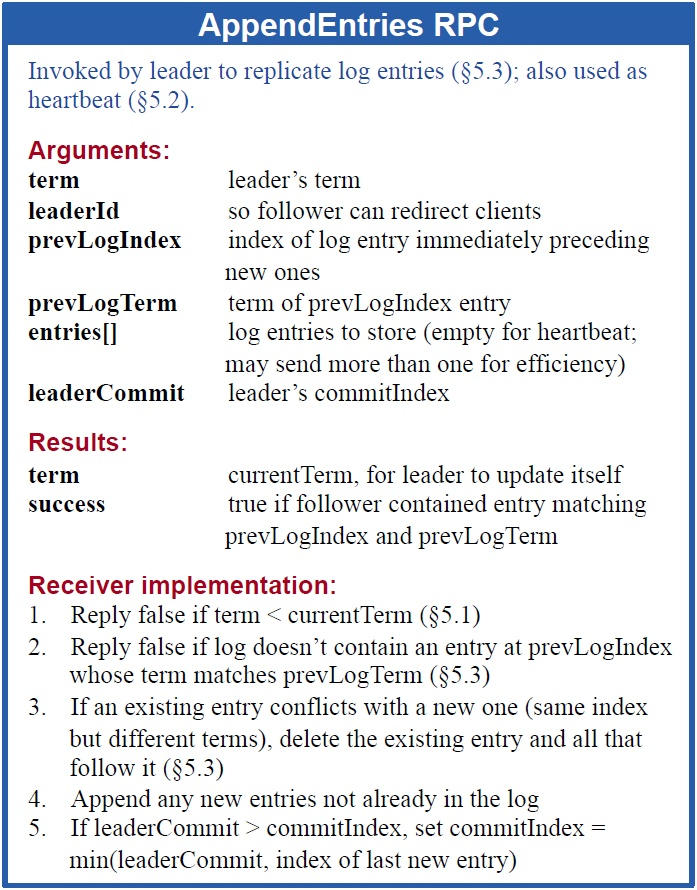
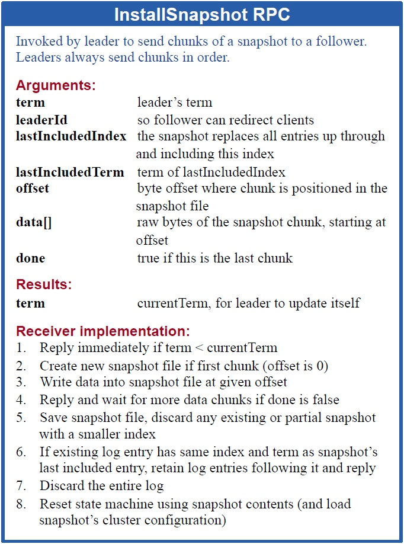

# 共识算法

## POW -- Proof of Work 工作量证明

1. 通过体现对哈希算法问题的解答获得证明

## POS -- Proof of Stake 股权证明

1. 根据持有数字货币的量和时间, 分配相应的利息

## DPOS -- Delegated Proof of Stake 委任权益证明

1. 比特股的 DPoS 机制, 股份授权证明机制 (又称受托人机制)
3. DPOS的出现最主要是因为矿机的产生, 大量的算力集中在不了解也不关心比特币的人身上
2. 让每一个持有比特股的人进行投票, 由此产生101位代表 (权利相等的超级节点/矿池), 通过代表生成区块, 再分成

## PBFT -- Practical Byzantine Fault Tolerance 实用拜占庭容错算法

1. PBFT 是一种状态机副本复制算法, 即服务作为状态机进行建模, 状态机在分布式系统的不同节点进行副本复制
2. 每个状态机的副本都保存了服务的状态, 同时也实现了服务的操作
3. 将所有的副本组成的集合使用大写字母 R 表示, 使用0到 |R|-1 的整数表示每一个副本
4. 假设 |R|=3f+1, 这里 f 是有可能失效的副本的最大个数, 尽管可以存在多于 3f+1 个副本, 但是额外的副本除了降低性能之外不能提高可靠性

至于说算法的选择, 这里引用万达季总的这一段话作为结束:

一言以蔽之, 共识最好的设计是模块化, 例如Notary
共识算法的选择与应用场景高度相关, 可信环境使用 paxos 或者 raft. 带许可的联盟可使用 pbft , 非许可链可以是 pow, pos, ripple 共识等
根据对手方信任度分级, 自由选择共识机制, 这样才是真的最优

## Raft

Raft 与 Multi-Paxos 相似的概念:

### 总结

Raft 算法各节点维护的状态:

Leader 的选举:

日志同步:

Raft 状态机:

安装 snapshot:

