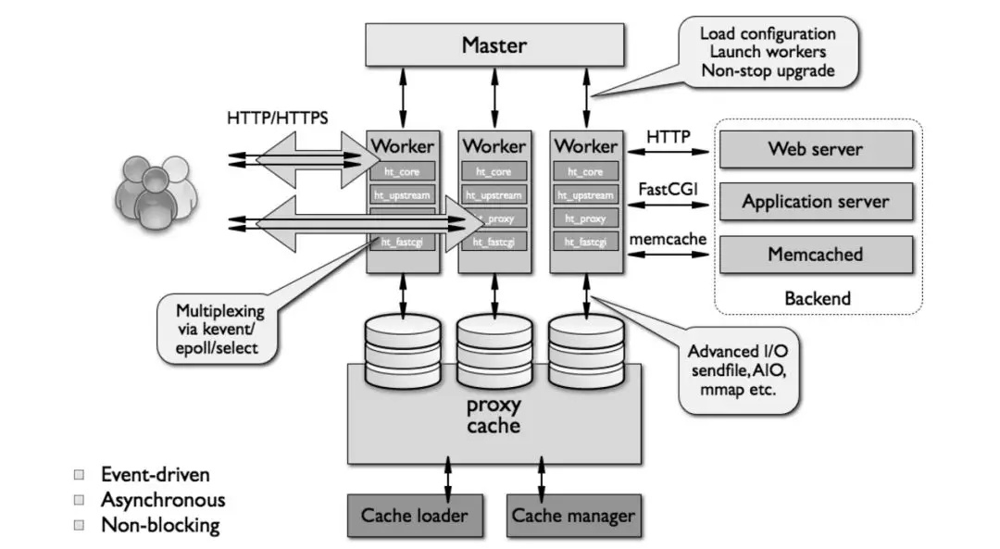

# 网关 -- 负载均衡 / 网络安全

## 负载均衡

按工作的协议划分: TODO:
- 四层负载均衡: 根据请求报文中的目标地址和端口进行调度(主要操作对象是 报文的地址/端口/MAC)
- 七层负载均衡: 根据请求报文的内容进行调度, 这种调度属于「代理」的方式(通过报文(的应用层)内容 动态/可配置 的操作)

按软硬件划分:
- 硬件:
  - F5: BIG-IP
  - Citrix: NetScaler
- 软件:
  - TCP: LVS(keepalived) / HaProxy / Nginx
  - HTTP: HaProxy / Nginx / ATS(Apache Traffic Server) / Squid / varnish
  - MySQL: Sharding-Sphere / MyCAT
  - MongoDB
    - Replica Set: TODO:
	- Sharding: ConfigServer(config) + Mongos(Router) + Replica Set(shard)
  - Redis -- Redis-Cluster / Codis

### F5

TODO:

### LVS

工作模型:
- VS/NAT(Virtual Server via Network Address Translation)
- VS/TUN(Virtual Server via Tunneling)
- VS/DR(Virtual Server via Direct Routing)
- VS/DNAT(Virtual Server via Destination Network Address Translation)

LVS 链的设备角色:
- VIP: Virtual IP , **LVS** 面向用户请求的 IP 地址 / Client IP
- RIP: Real server IP , **后端 Server** 用于与 LVS 通信的 IP 地址
- DIP: Director IP , **LVS** 用户和后端 Server 通信的 IP 地址
- CIP: Client IP , 客户端 IP 地址

#### Workmode: LVS-NAT

特点:
- Director 修改的报文内容是 **target IP**
- RealServer 集群节点和 Director 必须在同一个 IP 网段中
- Director 可负责端口映射
- Director 处于 client 和 RealServer 之间, 负责处理进出的所有报文, 并且是一个单节点, 因此在大规模场景会成为系统瓶颈(bottleneck)

#### Workmode: LVS-DR

特点:
- Director 修改的报文内容是 **target MAC** 地址
- **各 RIP 必须与 DIP 在同一个物理网络**
- RealServer 集群的 VIP 随 Director 变动而变动
- RealServer 的 VIP 不会对 ARP 的请求返回响应
- 客户端的响应报文不经过 Director, 大大提升 Director 的并发能力
- 必须保证前端路由器将目标地址为 VIP 的报文通过 ARP 解析后送往 **Director**
  - 静态绑定: 在前端路由将 VIP 对应的目标 MAC 地址静态配置为 Director VIP 接口的 MAC 地址
  - arptables: 在 Realserver 上, 通过 arptables 规则拒绝其响应对 VIP 的 ARP 广播请求
  - 修改内核参数: 在 Realserver 上, 修改内核参数, 并结合地址的配置方式实现拒绝响应对 VIP 的 ARP 广播请求
- 不支持端口映射(如果 Director 和 RealServer 也获得 端口配置, 能否支持 ??)

#### Workmode: LVS-TUN

特点:
- Director 通过 **IP 隧道技术**
- 集群节点可以跨越 Internet; RIP, DIP, VIP 都可以是公网地址
- RealServer 有自己的网关(可以独立于 Director)
- RealServer **必须** 使用支持 IP 隧道的操作系统
- 不支持端口映射

#### Workmode: LVS-DNAT

TODO:

均衡方式:
- 修改请求报文的源地址为 DIP, 目标地址为 RIP 来实现转发
- 对于响应报文, 源地址修改为 VIP, 目标地址修改为 CIP 来实现转发

特点:
- 支持端口映射

#### Workmode: LVS-FULLNAT

特点:
- 类似于 DNAT 的转发方式(不需要修改 MAC , 而是直接操作 IP 包和 TCP 包)
- 支持端口映射
- RIP , DIP 可以不在同一个网络中, RIP 网关不需要指向 DIP
- TODO:

#### 调度算法

静态调度:
- RR/round robin: 轮询, 在各主机间轮流调度
- WRR/weighted round robin: 加权轮询, 按照(已设定的)权重进行轮询
- SH/source hash: 源地址哈希
  - session affinity/会话绑定: 在一段时间内, 同一 client IP 地址的请求会被调度到相同的 RealServer(与 负载均衡 冲突)
- DH/destination hash: 目标地址哈希, 当 RealServer 为透明代理缓存服务器时, 提高缓存的命中率

动态调度: 由 活动链接(active) / 非活动链接(inactive) / 权重(weighted) 来决定调度选择
- LC/least connected: 最少连接, `overhead = active<<8+inactive` , 根据 overhead 选择最小的 RealServer
- WLC/weighted lc: 加权最少连接, `overhead = (active<<8+inactive)/weight` ; 默认调度算法
- SED/shortest expected delay: 最短期望延迟, `overhead = (active+1)*256/weight`
- NQ/never queue: 当由空闲 RealServer , 直接调度到该 RealServer ; 否则 , 按照 SED 算法调度
- LBLC/locality based least connection: 基于本地的最少连接, 即 `DH + WLC`
  - 正常请求下使用 DH , 目标服务器超载下通过 WLC 算法调度至其他 RealServer
- LBLCR/locality based least connection with replication: 基于本地的带复制功能的最少连接
  - LVS 管理 服务池, 通过 DH 算法将请求 IP 映射到对应服务池, 通过 LC 算法选择服务池中的节点, 当池中所有节点都超载, 则通过 LC 算法从所有 Realserver 中选择一个添加到服务池

#### keepalived

#### OSPF + FullNAT LVS

#### 总结

优点:
- 操作传输层及以下, 适用面极广
- 抗负载能力/性能强, CPU/内存 消耗低
- 稳定, 完整双机热备方案: LVS + Keepalived
- 无流量

不足:
- 无应用层功能: 无动静态分离能力, 无正则表达式功能

### Nginx

模块化/基于事件驱动/异步/单线程非阻塞

## 防火墙

### nftables

### iptables

- iptables 是内核驱动模块, 随内核迁移升级
- iptables 是监控 linux inode 的状态, 更安全

### firewall

- firewall 是 systemd 服务

## 附录

### 交换机虚拟化

|       | 优点                                                                             | 缺点                                                     | 应用场景                       |
| :-    | :-                                                                               | :-                                                       | :-                             |
| 堆叠  | 简化本地网络管理节点、易维护，同时增加系统端口密度和带宽，充分发挥设备性能       | 可靠性不高，堆叠系统分裂、系统升级都会影响业务中断       | 广泛应用于企业、教育           |
| VRRP  | 网络设备冗余、可靠性高                                                           | 配置复杂、网络建设投入成本高，不能充分发挥设备的网络性能 | 银行、证券、政府内网           |
| M-LAG | 网络可靠性非常高，设备控制层面独立，能单独设备升级且不影响业务，充分发挥设备性能 | 管理节点多(控制层面无法虚拟化)                           | 银行、证券、数据中心(双规场景) |
