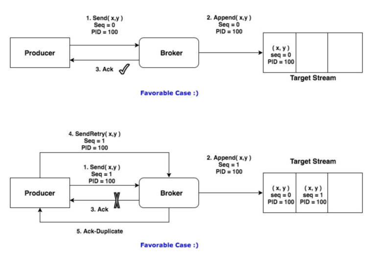

# Kafka


- Topic: 逻辑消息
  - 不同的 Topic 之间不保证数据相关
- Partition: Topic 在每个 Broker 上的物理记录集, 用于负载均衡以及复制
  - 同一 Partition 内保证数据顺序, 不同 Partition 之间不保证数据相关
- Broker: kafka server 实例

## 数据一致性与可靠性

Kafka 通过 AR/Assigned Replicas 列表记录当前主分区的所有复制, AR 由 ISR 和 OSR 组成:
- ISR(in sync replica): 是 kafka 动态维护的一组同步副本, 在 ISR 中有成员存活时, 只有这个组的成员才可以成为 leader
  - 内部保存的为每次提交信息时必须同步的副本(acks = all)
  - 每当 leader 挂掉时, 在 ISR 集合中选举出一个 follower 作为 leader 提供服务, 当 ISR 中的副本被认为坏掉的时候, 会被踢出 ISR , 当重新跟上 leader 的消息数据时, 重新进入 ISR
- OSR(out sync replica): 保存的副本不必保证必须同步完成才进行确认; OSR 内的副本是否同步了 leader 的数据, 不影响数据的提交, OSR 内的 follower 尽力的去同步 leader, 但仍可能数据版本会落后

## 配置

```conf
# The maximum number of unacknowledged requests the client will send on a single connection before blocking. Note that if this setting is set to be greater than 1 and there are failed sends, there is a risk of message re-ordering due to retries (i.e., if retries are enabled).
# 客户端在 单个连接 上能够发送的 未响应请求的个数; 消息的并发度
max.in.flight.requests.per.connection = 1

# 幂等数据
enable.idempotence=true
```

幂等性依据: 在 Topic 级唯一 的`Seq`?


