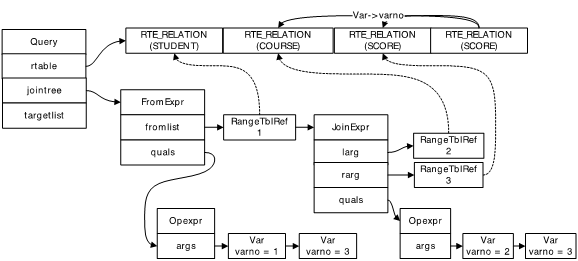
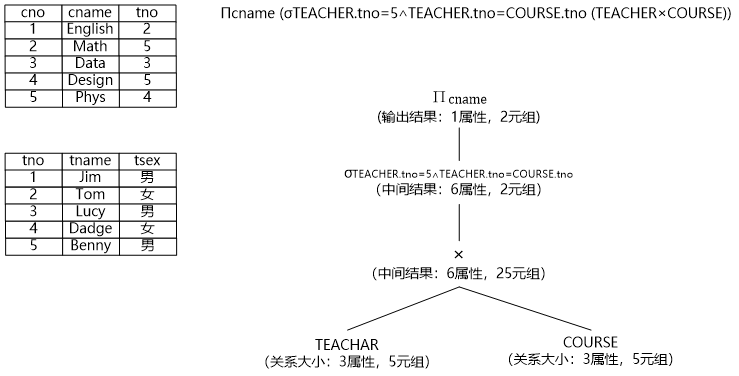
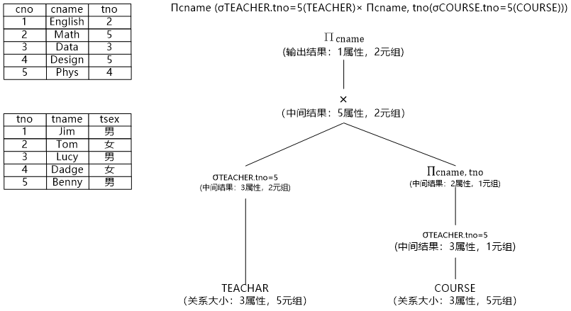

# PostgreSQL 入门

## 常用命令

- \l -- 列出所有的数据库
- \c <dbname> -- 切换数据库
- \d -- 列出当前库的所有表
- \d <tablename> -- 列出该表的使用字段
- \d+ <tablename> -- 查看表的基本情况(比 \d 多一个存储列)
- \x -- 开启/关闭扩展显示(行式 <-> 列式)

## 逻辑优化


```sql
SELECT st.sname, c.cname, sc.degree FROM STUDENT st , COURSE c INNER JOIN SCORE sc ON c.cno = sc.cno WHERE st.sno = sc.sno
```



TODO:

### 子查询&子连接提升

区分:
- `FROM` 关键字后的子句是子查询语句
- `WHERE/ON` 等约束条件中或投影中的子句是子连接语句

#### LATERAL

```sql
SELECT * FROM TEST_A WHERE a > ANY (SELECT a FROM TEST_B WHERE TEST_A.b = TEST_B.b);

SELECT * FROM TEST_A, (SELECT a FROM TEST_B WHERE TEST_A.b = TEST_B.b) b WHERE TEST_A.a > b.a;

SELECT * FROM TEST_A, LATERAL (SELECT a FROM TEST_B WHERE TEST_A.b = TEST_B.b) b WHERE TEST_A.a > b.a;
```

### 表达式预处理

### 外连接消除

外连接转换为内连接

### 谓词下推

```sql
> Πcname (σTEACHER.tno=5 ∧ TEACHER.tno=COURSE.tno (TEACHER×COURSE))
> SELECT {DISTINCT} cname FROM TEACHER, COURSE WHERE TEACHER.tno=5 AND TEACHER.tno=COURSE.tno;

--- 经过谓词下推和投影下推

> Πcname (σTEACHER.tno=COURSE.tno (σTEACHER.tno=5(TEACHER) × Πcname, tno(COURSE)))
> SELECT sname FROM (SELECT * FROM TEACHER WHERE tno = 5) tt, (SELECT cname, tno FROM COURSE) cc WHERE tt.tno = cc.tno;
```

### 连接顺序交换

### 等价类推理

```sql
> SELECT sname FROM (SELECT * FROM TEACHER WHERE tno = 5) tt, (SELECT cname, tno FROM COURSE) cc WHERE tt.tno = cc.tno;

--- 经过等价推理
> SELECT sname FROM (SELECT * FROM TEACHER WHERE tno = 5), (SELECT cname, tno FROM COURSE WHERE tno = 5);
```

### demo



经过 **选择下推、投影下推和等价类推理** , 形成结果:



## 物理优化
