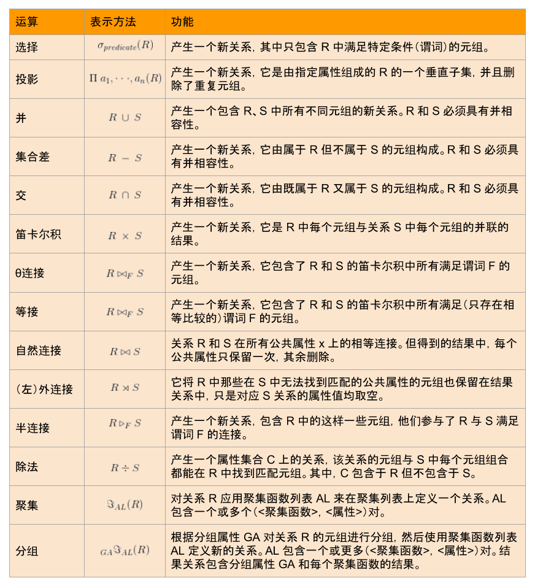

# SQL Language

## 关系代数 和 SQL 语言



基础运算符:
- 选择(σ , selection) -- where
- 投影(π , projection) -- select distinct ...
- 叉乘/笛卡尔积(x , cross-product) -- `from`, R 中每个元组和 S 中每个元组 **并联** 的结果
- 差(- , set-difference) -- R-S === 在 R 中不在 S 中的元组
- 并(υ , union) -- RuS === 在 R 和 S 中的所有元组
- 重命名(rename)

合成运算符:
- 交(∩ , intersection) -- R∩S === 在 R 中也在 S 中的元组
- 除(÷ , division) -- R÷S === R 中包含与 S 共有列相同, 其他列不同的关系实例 (??)
- δ(R) 能对关系 R 消除重复元组
- θ 链接 -- R 和 S 的笛卡尔乘积中所有满足谓词 F 的元组
- 等值链接(=, equival join) -- θ 链接的特例, (??)
- 自然链接(⋈, natural join) -- 先做叉乘, 再选择 *公共属性一样* 的关系实例

谓词 F 的格式:


## exists/in/all/any/some

- exists/in
- all/any/some

### exists

- 相关子查询
- 不返回查询的结果, 只返回 `true`/`false`
- 先运行 **主查询** 一次, 再去子查询里查询与其对应的结果, 如果是 true 则输出, 反之则不输出. 再根据主查询中的每一行去子查询里去查询

### in

- 返回结果集
- **子查询** 先产生结果集, 然后主查询再去结果集里去找符合要求的字段列表去. 符合要求的输出, 反之则不输出

### all

对所有数据都满足条件, 整个条件才成立

### any

只要有任一条数据满足条件, 整个条件成立

### some

等价于 any

## 外键约束

- CASCADE: Delete row from parent and automatically delete matching rows in child, and so on in cascading manner
- SET NULL: Delete row from parent and set FK column(s) in child to NULL. Only valid if FK columns are NOT NULL
- SET DEFAULT: Delete row from parent and set each component of FK in child to specified default. Only valid if DEFAULT specified for FK columns
- NO ACTION: Reject delete from parent. This is the default setting if ON DELETE rule is omitted

## 连接

### join

### outer-join

### semi-join

`exists/in`

### anti-join

`not exists/in`

```sql
SELECT * FROM STUDENT LEFT JOIN SCORE ON STUDENT.sno = SCORE.sno WHERE SCORE.sno IS NULL;

转换为

SELECT * FROM STUDENT ANTI JOIN SCORE ON STUDENT.sno = SCORE.sno;
```
