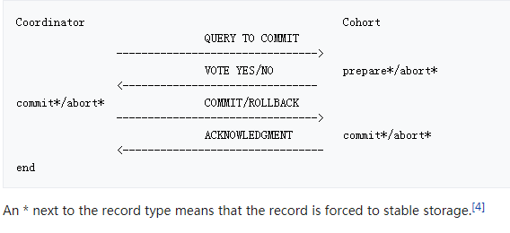
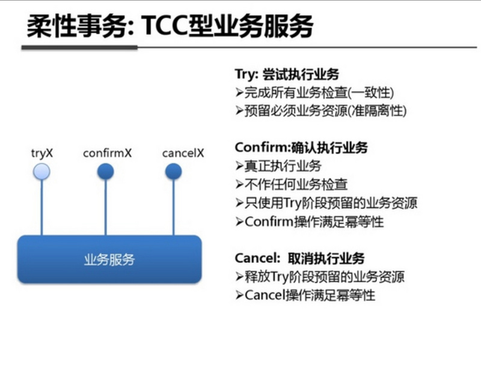
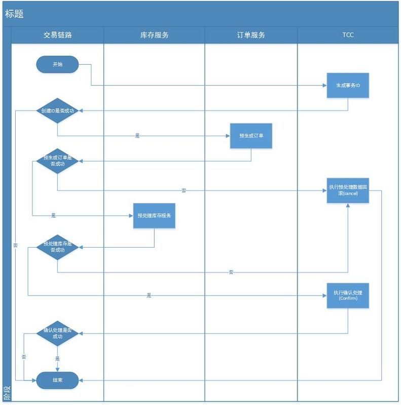
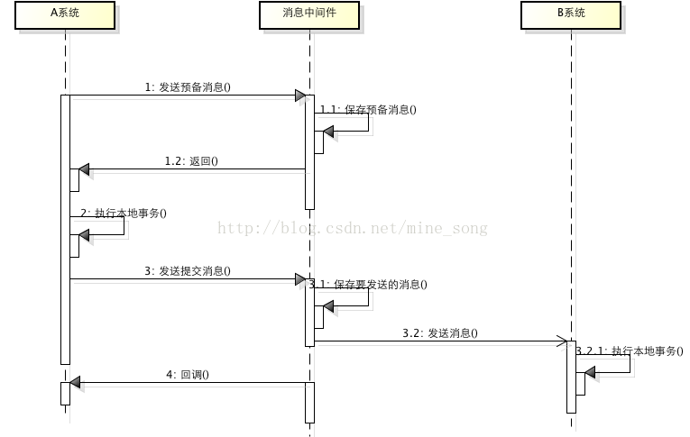

# 一致性

## 事务

### OCC/Optimistic Concurrency Control

操作步骤:
1. read phase: 读记录, 修改/添加记录的私有副本
2. validation phase: 冲突检查, 无冲突则提交, 有冲突则 abort and restart
3. write phase: 事务提交, 则安装私有副本, 使修改生效; 否则回滚并清理该事务的私有副本

#### 冲突检测

- 时间戳

#### 总结

- 优点:
  - 没有全局锁
- 缺点:
  - 冲突频繁(抢购)的场景会导致多数事务最多两次的写盘(添加私有副本/清除私有副本)

### MVCC

### 2PL

- 扩展阶段: 获得锁, 不释放锁
- 进行已锁内容的操作
- 收缩阶段: 释放锁, 事务结束

## 分布式一致性/分布式事务

### XA 协议 -- 2PC



MySQL:


### 3PC

3PC 与 2PC 相比:
- 提交(commit) 比 回滚(rollback) 多 1RTT
- 添加超时机制
- (??)在 2PC 之后添加一个检验查询


### TCC/Try-Confirm-Cancel

- Try 阶段: 完成所有的子业务(事务?)检查, 预留必要的业务资源, 实现业务间的隔离
- Comfirm 阶段: 执行业务
  - 幂等性: 支持重试
- Cancel 阶段: 释放 Try 阶段预留的业务资源
  - 幂等性

与 2PC 相比, 特点:
- TCC 定位是一个 TransactionManager , 它需要接管 数据资源/事务流程 和 业务流程
- 位于业务服务层而非资源层, 由业务层保证原子性
- 没有单独的准备(Prepare)阶段, 降低了提交协议的成本
- Try 操作, 兼备 资源操作(lock resource) 与 准备(prepare) 能力
- Try 操作可以灵活选择业务资源的锁定粒度(实时读/快照读/写 ?), 而不是锁住整个资源, 提高了并发度

难点:
- 每个子业务都需要有相应的 comfirm、cancel 操作, 即实现相应的补偿逻辑



以一次下单流程为例:



### 基于(异步)消息的分布式事务

思路:
1. 将分布式事务(主事务)分成多个本地事务(从事务)
2. 主事务本地先行提交, 然后通过消息通知从事务, 从事务从消息中获取信息进行本地提交

特点:
- 异步事务机制、只能保证最终一致性
- 可用性非常高, 不会因为故障而发生阻塞

基于异步消息的 **事务机制** 主要有两种方式: 本地消息表与事务消息

#### 本地消息表

指将消息写入本地数据库, 通过本地事务保证主事务与消息写入的原子性

伪代码:
```
begin transaction:
　　update User set account = account - 100
        where userId = 'A';
　　insert into message(userId, amount, status)
        values ('A', 100, 1);

commit transaction
```

然后通过 poll/push , 从业务获取消息并执行:
- push: 使用具有持久化功能的 消息队列 , 从事务订阅消息
- pull: 从事务定时拉取消息, 然后执行

#### 事务消息

利用消息中间件实施两阶段提交, 将本地事务和待发消息放在了一个分布式事务里, 保证要么本地操作成功成功并且对外发消息成功, 要么两者都失败

执行步骤:
1. 主事务(M)向消息队列(MQ)发送预备消息(prepare)
2. 主事务(M)收到响应(reply)之后本地执行主事务
3. 根据执行的结果(成功或失败)向消息队列(MQ)发送提交或者回滚消息, 同时返回结果到客户端(C)
4. 消息队列(MQ)提交后, 发送从事务消息
5. 从事务(S)订阅并接收事务消息, 执行
6. 消息队列(MQ)收到所有从事务(S)的提交消息, 将最终结果回调(返回)给主事务(M), 事务流程结束



难点:
- 消息队列(MQ)非常重要, 功能也非常特殊, 高度定制+高可用+高稳定性

## InnoDB 一致性

### 事务的隔离级别

- 未提交读(URC - read uncommit) -- 一个事务可以读取另一个 **未提交** 的数据
- 提交读(RC - read commit) -- 在一个事务提交后, 另外的事务才能够读取到提交的变化; 可能同时出现事务读取操作前后的不一致, 即 **幻读**
- 可重复读(RR - read repeatable) -- 在该事务操作的整个过程中, 读取的数据都是一致的; 但 **不保障** 实际的数据不被修改
  - 通过 `mysqldump --single-transaction` 设置事务为 RR 模式
  - `mysqldump --single-transaction` 期间 **不能执行 `alter table/drop table/rename table/truncate table` 等 DDL 语句**, 因为它们会导致无法使用 undo 构造出正确的一致性读, 同时返回错误-`ER_TABLE_DEF_CHANGED` :
    - `DROP TABLE` 会根本的破坏该表
    - `ALTER TABLE` 会生成原始表的临时副本, 并在构建临时副本后 **删除原始表**
    - `CREATE TABLE` 在事务中 *重新* 发出一致性读时, 新表中的行不可见, 因为在执行事务时这些行不存在
- 序列化(serializable) -- 所有的事务操作串行处理; 牺牲了效率

不同隔离级别下, 可能的问题:
- 脏读: 读到没有提交的数据, 不符合事务上的一致性
- 非重复读: 重复读但是结果不完全一致
- 幻读: select 读到的数据和 update 修改时的搜索到的数据不一致

| 隔离级别     | 脏读 | 非重复读 | 幻读 |
| :-:          | :-:  | :-:      | :-:  |
| 未提交读 URC | Y    | Y        | Y    |
| 提交读 RC    |      | Y        | Y    |
| 可重复读 RR  |      |          | Y    |

Innodb 默认是 **可重复读** 级别, 提供了以下手段, 以避免幻读:
- select * from table for update; (排他写锁)
  - 使用 Innodb 提供的 **next-key locks** 锁定被操作的表, 令该表获得该事务期间的 **序列化**
- select * from table lock in share mode; (共享读锁)
  - **next-key locks** 获得 **加锁读**

在没有 `with consistent snapshot` 的事务中, 视图生成的时间是第一个实际操作(`select`, `update`, `delete`, `insert`)的时间; 因此在对一致性要求严格的场景建议添加 `with consistent snapshot` 显式生成视图

#### 事务的大坑 -- 丢失更新

1. 更新(update)数据都是先读后写, 而这个读, 只能读 *当前(最新已提交事务, 无论这个事务(`row trx_id`)是否在当前事务的 数据版本 中)* 的值, 即 `当前读--current read`, 应对:
    - 添加 `lock in share mode` 读锁(S 锁, 共享锁) 或者 `for update` 写锁(X 锁, 排他锁)

### MVCC -- InnoDB 的多版本并发控制

- 每行记录后面都会由两个隐藏的列
- 这两列分别保存该行的 **创建时间** 和 **删除时间** 对应的系统版本号
- 系统版本号随操作(update, insert, delete)的进行而递增
- 设该事务版本号为 X , 无锁操作下会查找 创建版本号 <=X 且 删除版本号 >X(或 undefined) 的行

### Innodb 锁相关

1. 记录锁(Read Lock/Record Lock): 在行相应的索引记录上的锁

2. gap 锁: 是在索引记录间歇上的锁 -- 锁定一个范围, 但不包含记录本身

3. next-key 锁: 是记录锁和在此索引记录之前的 GAP 上的锁的结合 -- 锁定一个范围, 并且锁定记录本身

4. innodb 行锁的加锁方式: 当根据 innodb 表的索引搜索时, 设置共享锁(S)和排它锁(X) (以及意向共享(IS) 或 意向排他(IX)) 在索引记录上

5. 行锁实际上是索引锁

6. innodb_locks_unsafe_for_binlog: 当为 0 时 (disabled), 这个开启了 gap 锁; 设置为 1, 关闭 gap 锁(这会导致幻读,引起主从同步不一致)

7. 开启这个选项 innodb_locks_unsafe_for_binlog 并不关闭 gap 锁在外键检查方面的作用

8. 在 UPDATE 和 DELETE 时, innodb 首先对遇到的每一行加行锁; 如果 innodb_locks_unsafe_for_binlog 开启, 那么不匹配的行上的锁将被释放; 如果未开启, 不匹配的行上的锁也不释放, 直到事务结束

9. 即使 innodb 表上没有索引, 也会使用内部的 clustered index 来进行锁定

10. innodb 除主键的索引之外的其他索引和 clustered index 在内部是建立一张索引对应表; 当利用其他索引扫描记录时, 对其他索引加的锁最后都转换为对 clustered index 的锁

11. 在 UPDATE 模式下, 对检索中遇到的记录加排它锁; 在 INSERT...SELECT 模式下, 对检索中遇到的记录加共享锁(S); 在 INSERT 模式下, 对检索中遇到的记录加排它锁(X); 在 DELETE 模式下, 对检索中遇到的记录加排它锁

12. 在使用 unique index 进行搜索, 并且只返回一行时, 不使用 gap 锁

13. next-key 锁举例: 假设索引包括 10, 11, 13, 20, 则 next-key 锁为: (negative infinity, 10], (10, 11], (11, 13], (13, 20], (20, positive infinity)

14. 使用 next-key 锁可以预防幻读

15. gap 锁在 read_committed 下或当 innodb_locks_unsafe_for_binlog=on 时被关闭; 当在这种情况下时, 不匹配的行上的锁将被释放

### 普通索引的 更新(update) -- change buffer

如果待更新的数据页不在 内存 中, InnoDB 先把 更新(update) 的语句缓存在 change buffer , 且暂时不从磁盘中读入数据页; 等需要 查询(select) 该数据页时再 读入-更新 同时操作

在检索一个不在内存中的索引记录时:
- 唯一索引: 读入数据页到内存, 判断如果没有冲突, 则插入这个值, 语句执行结束
- 普通索引: 将更新记录在 change buffer , 语句执行结束(待下次 读取(select) 时真正更新数据)

建议:
- 由于 普通索引 + change buffer 的组合在 更新(update)频繁 的场景比 唯一索引 性能提升更显著, 而在其他场景差距微小, 因此尽可能的选用 **普通索引 + change buffer** 的组合

redo log 与 change buffer 的性能收益:
- redo log: 节省随机写磁盘的 IO 消耗(顺序写)
- change buffer: 节省随机读磁盘的 IO 消耗
