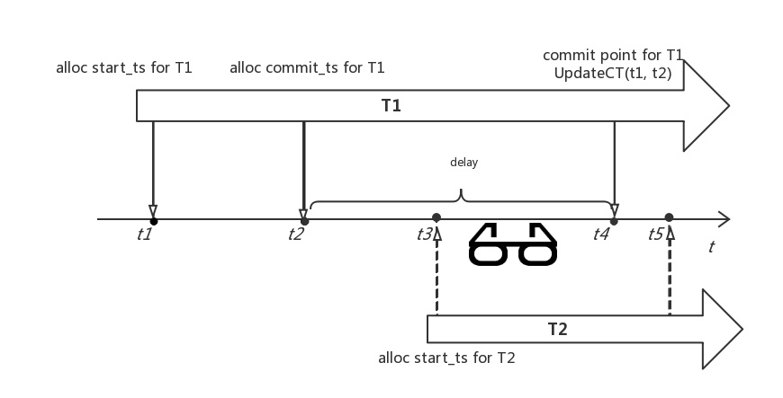

# Omid


- Omid 通过记录 key 的 (murmur3)hash 替代 key , 减少存储空间

```java
public long getCellId() {
    return Hashing.murmur3_128().newHasher()
        .putBytes(table.getTableName())
        .putBytes(row)
        .putBytes(family)
        .putBytes(qualifier)
        .hash().asLong();
}
```

# Omid


从架构图获得 部署/组件职责/组件交互 的信息

## 部署

构成 Omid 的三个组件为: Client, TM(Transaction Manager) 和 Persistent Storage
- Client/Transaction Client(TC): 发起事务, 读/写私有副本, 提交新版本和更新本地版本
- TM(单点): 处理 Client 请求, 分配时间戳, 冲突检测, 提交事务, 写 Persistent Storage 和高可用
- Persistent Storage: 提供可靠的多版本(MVCC ?)的持久化 key-value 存储, 支持单行原子操作或事务

## 组件交互(data flow/control flow)


说明:
1. Client 执行 BEGIN 操作发起事务, 请求 TM 分配 txid (txid 即为 start_ts)
2. TM 管理逻辑时钟, 产生严格单调递增序列, 给 Client 分配 txid(txid 即具有唯一性以区分不同事务, 又可以作为 key-value 的版本编号, 还能用于判断事务的执行区间是否重叠)
3. Client 执行读操作 GET/READ 从 Data Store 中获取数据
4. Client 根据读出的值, 计算结果, 调用函数 PUT/WRITE 执行 tentative write, **尝试** 往 Data Store 写私有版本
5. Client 执行 COMMIT 操作发起提交, TM 分配 commit_ts, 做 **backward 冲突检测**, 决定事务提交/回滚; 如果提交, 则调用 UpdateCT 写 (txid, commit_ts) 到 CT 表中并落盘, 至此, TM 事务提交完成
6. Client 根据 TM 提交返回的结果, 完成后续操作: 如果事务回滚, 则 *撤销 tentative 创建的私有版本(回滚成本高)* ; 如果事务提交成功, 则安装 tentative write 创建的私有版本, 并且删除提交信息

## Omid 数据模型和事务处理

### Omid 事务:

- 事务所访问的数据为共享的, 可靠的, 持久化的多版本的 key-value item 集合(shared reliable persistent multi-versioned key-value item)
- 事务是对若干 item 的执行 read/write(i.e. get/put) 操作(跨行事务特性)的序列
- 该操作序列为 begin 和 commit 所包围, 具有 *ACID* 特性

### DT 表和 CT 表

Omid 在 HBase 中创建 Data Table(addr. DT) 和 Commit Table(addr. CT) , 用于存储 item 和 commit 信息
- DT 表: 存储 committed/tentative update
- CT 表: 存储事务的提交标记(是否包括暂存?)

通过 SQL 表示两表结构:

```sql
CREATE TABLE DT (
    key VARBINARY(1024),
    value VARBINARY(1024),
    txid BIGINT, # txid 即为 start_ts
    commit_ts BIGINT,
    PRIMARY KEY(key, txid)
);

CREATE TABLE CT (
    txid BIGINT PRIMARY,
    commit_ts BIGINT UNIQUE
);
```

DT 表中的单行记录表示 item 的一个版本, 事务更新某 key 时, 在 DT 表中插入一条记录, `txid` 和 `commit_ts` 保存事务 ID (开始时间戳 `start_ts` 和 提交时间戳 `commit_ts`)

### Omid 事务 Atomicity/Durability/Recovery

在使用 redo/undo log 的单机事务中, `<COMMIT T>` 落盘时间是事务 T 的 commit point

`UpdateCT(T.txid, T.commit_ts)` 成功执行的事件, 是事务 T 的 commit point, 是事务 T 处于 aborted/outstanding 状态还是 committed 状态的分水岭, 相当于 redo/undo `<COMMIT T>` 成功落盘的事件

数据库 crash 后重启, 恢复事务 T 的操作:
- log 中若存在 `<COMMIT T>` , 则顺序的 redo 事务 T 操作日志
- 否则, 如果事务 T 处于 aborted 或者 outstanding 状态, 反序的 undo 事务 T 的操作日志

tentative write 通过向 DT 表插入新记录以更新 commit 状态

DT 表的 commit_ts 属性:
- `commit_ts == NULL`: tentative 私有暂时版本
- `commit_ts == T.commit_ts`: committed 版本, 内有创建该事务的 txid 和 commit_ts

Omid 的事务状态
- outstanding: 事务尚在执行中; 如果 client 或 TM 发生 crash , 则主动进入 aborted status
- aborted: 事务已经回滚; TM 执行并发控制逻辑时, 发现事务 T 无法进行下去, 则使其回滚
- committed: 事务成功提交; 到达 commit point
- complete: 事务回滚或提交后, 完成后续的 roll-forward 和 rollback 操作

**Omid 恢复时, outstanding 和 aborted 都作为 aborted 事务处理**

roll forward 的时机:
- 相关 client: 事务 T 提交后, 执行事务 T 的 client 继续主动 roll forward
- piggyback(携带)方式: 事务 T2 读 item 时, 读到 DT 表中 T1 创建的 tentative 版本, 再查阅 CT 表, 发现 T1 已提交, 则安装该版本
- 后台 cleanup 进程: 异步扫描 CT 表和 DT 表, 作 roll forward 处理

rollback 的时机:
- 事务 T 失败, 主动撤销 tentative 版本
- piggyback(携带)方式: 事务 T2 读记录时, 发现 DT 表中的存在 write-too-late 问题的过期事务 T2 的 tentative 版本, 尝试 kill transaction 并撤销 tentative 版本(? 是否有该操作)

总结:

UpdateCT 成功执行事件时 commit point , 成功则 roll forward (顺序 redo), 失败则 rollback(反序 undo)

### 事务并发控制和隔离性

Omid 采用 MVCC (而非 Lock-based CC), 通过冲突检查(conflict detection) 的方式, 以决定对事务的处理

事务属性:
```shell
1. start_ts: start timestamp, 事务开始执行的时间戳; 等同于 txid, read timestamp
2. commit_ts: commit timestamp, 事务提交的时间戳
3. [start_ts, commit_ts]: 事务的持续时间, 事务执行的时间区间, 用于冲突检查
4. read_set: 事务读操作的元素集合
5. write_set: 事务写操作的元素集合
```

冲突检测: 事务 T1 和 T2 同时具备如下两个条件则冲突:
```shell
Condition I:
    执行区间重叠, i.e. T2.start_ts < T1.commit_ts || T1.start_ts < T2.commit_ts
Condition II: 
    write_set 重叠: T1.write_set ∩ T2.write_set ≠ ∅
```
因为以上操作违反:
I: 事务在不同的时间段执行, 即串行执行
II: 事务修改的元素无交集(disjoint), 访问数据库的不同部分

事务调度的目标: 让无冲突的事务, 并发执行; 让有冲突到事务通过 wait 和 rollback 的方式相互错开而串行执行

注意:
1. Omid 是 OCC 协议, 并混杂了 MVCC
2. OCC 在 validate phase 阶段, 还需要检查当前事务的 `read_set` 与已验证过的事务的 `write_set` 是否有冲突
3. Omid 由于采用多版本, 事务 T 可以直接读取 T.start_ts 时刻的 snapshot 的最新版本的数据

backward 冲突检查: 检查集合 {T|T0.start_ts < T.commit_ts} 中的事务是否和 T0 冲突(与已提交的事务的冲突)
forward 冲突检查: 检查集合 {T|T.start_ts < T.commit_ts} 中的事务是否和 T0 冲突(与未提交的事务的冲突)

**Omid 采用 backward 冲突检查**

#### 隔离性 1: 事务 T0 能够读到提交时间早于 T0 开始时间的所有事务的变更

即:
- T0 可以读到 {T|T.commit_ts < T0.start_ts} 的全部(累计)结果
- T0 开始前已经提交的事务产生的变更对 T0 可见
- T0 能够读到 T0.start_ts 时刻的 snapshot

**write-too-late**: 由于前一事务的写由于 **故障等不正常因素** 导致后一事务 **读** 操作在于前一事务的 **写** 操作

出现 write-too-late 的原因:



因此, 需要保持以下的 invariant:

```text
TM 处理事务 T0 的 BEGIN 请求时,
集合 S={T|T.commit_ts < T0.start_ts} 是早于 T0 开始提交到事务,
只有等到 S 中的所有事务执行完 UpdateCT(T.start_ts, T.commit_ts)(落盘)或 abort 后, 
TM 才能返回 T0.start_ts
```

即: 事务集合 S 确定点(fsync OR abort) 可延迟到最迟 T0.start_ts 之前

**在同一 TM 中, 能够保持该 invariant; 当 TM 做 failover 时, 无法保持该条件**

#### 隔离性 2: 事务 T0 和已提交的事务冲突, 则 T0 必须回滚

例如: 存在 T s.t. T is committed && T0.start_ts < T.commit_ts < T0.commit_ts, 则 T0 必须回滚
(完全是因为没有互斥队列的缘故...)

总结:

隔离性是指: 1.事务提交则对后续事务可见, 2.事务和已提交事务发生冲突则夭折

不满足隔离性则会出现 Stale Read 和 Lost Update anomaly

### TM 冲突检查

```text
假设T0是TM正在提交的事务, 则:

与 T0 冲突的 committed 事务集合: 
    ConflictSet(T0) = 
        {T.txid | T is committed && T conflicts with T0 }
与 T0 执行时间区间重叠的 committed 事务集合:
    OverlappingSet(T0) = 
        {T.txid | T is committed && T0.start_ts < T.commit_ts}
执行时间区间重叠是事务冲突的必要条件, 所以:
    ConflictSet(T0) ∈ OverlappingSet(T0)
    

TM 维护活跃事务的最小 txid
    min_outstanding_txid = MIN{T.txid | T is outstanding}
与活跃事务有可能存在冲突的已提交事务集合:
    PotentialConflictSet = 
        {T.txid | T is committed && min_outstanding_txid < T.commit_ts}
显然, min_outstanding_txid < T0.start_ts, 所以
    ConflictSet(T0) ∈ OverlappingSet(T0) ∈ PotentialConflictSet

TM 的 hash table 表只需要维护 PotentialConflictSet 中所有事务的 write_set 的并集;
可以将 hash table 看成是 DT 表的同步更新的物化视图:
    CREATE MATERIALIZED VIEW HashTable
    AS
    SELECT key, MAX(commit_ts) AS last_commit_ts
    FROM DT
    WHERE min_outstanding_txid < commit_ts 
    GROUP BY key; 

冲突检查的逻辑也可以用 SQL 表达为:
    SELECT COUNT(*)
    FROM HashTable
    WHERE key in T0.write_set and T0.txid < last_commit_ts

如果为 0, 则无冲突; 否则, 存在冲突
```

即**hash table 中保存提交时间晚于最小活跃事务开始时间的已提交事务的 write_set 中 key 和 key 最近修改时间**

T0 可提交的判断:
- `T0.write_set` 中所有 key, 在 hash table 中没有出现
- `T0.start_ts > last_commit_ts`

提交后, 将 `write_set` 中的每个 key 和 `T0.commit_ts` 作为 key-value 对插入到 hash table 中, 并且执行 `UpdateCT(T0.start_ts, T0.commit_ts)`

#### TM 优化
