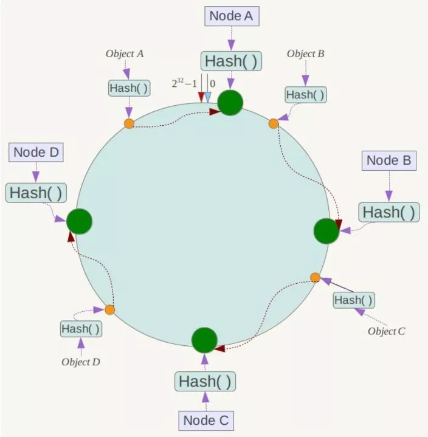
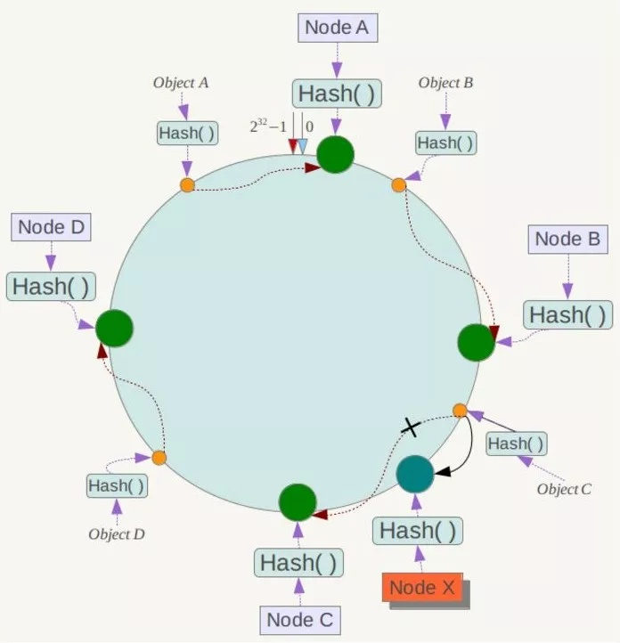

# Redis

## 概念

### 一致性 Hash

- [redis 一致性hash算法 - 浩子的博客 - CSDN博客](https://blog.csdn.net/u013851082/article/details/68063446)
- [面试必备: 什么是一致性Hash算法](https://zhuanlan.zhihu.com/p/34985026)






### hash_slot

redis 计算 cluster: `solt = crc16(key) & (16384-1)`

1. 集群规模: Redis 集群中主节点的数量基本不可能超过 1000 个
2. 心跳包: redis 的一个节点的心跳信息中需要携带该节点的所有配置信息, 而 16K 大小的槽数量所需要耗费的内存为 2K, 但如果使用 65K 个槽, 这部分空间将达到 8K, 心跳信息就会很庞大
3. slot/槽的利用率: Redis 主节点的配置信息中, 它所负责的哈希槽是通过一张 bitmap 的形式来保存的, 在传输过程中, 会对 bitmap 进行压缩, 但是如果 bitmap 的填充率 (slots/N) 很高的话, bitmap 的压缩率就很低, 所以 N 表示节点数, 如果节点数很少, 而哈希槽数量很多的话, bitmap 的压缩率就很低; 而 16K 个槽当主节点为 1000 的时候, 是刚好比较合理的, 既保证了每个节点有足够的哈希槽, 又可以很好的利用 bitmap
4. cnc16 结果的均匀分布: 选取了 16384 是因为 crc16 会输出 w16bit 的结果, 可以看作是一个分布在 0-2^16-1 之间的数, redis 的作者测试发现这个数对 2^14 求模的会将 key 在 0-2^14-1 之间分布得很均匀, 因此选了这个值

## 架构模式

### 集群(redis>=3.0)

从 redis 3.0 之后版本支持 redis-cluster 集群, redis-cluster 采用无中心结构, 每个节点保存数据和整个集群状态, 每个节点都和其他所有节点连接

特点:
1. **无中心架构**(不存在哪个节点影响性能瓶颈), 少了 proxy 层
2. 数据按照 slot 存储分布在多个节点, 节点间数据共享, 可动态调整数据分布
3. 可扩展性, 可线性扩展到 1000 个节点, 节点可动态添加或删除
4. 高可用性, 部分节点不可用时, 集群仍可用; 通过增加 Slave 做备份数据副本
5. 实现故障自动 failover, 节点之间通过 **gossip** 协议交换状态信息, 用投票机制完成 Slave 到 Master 的角色提升

缺点:
1. 资源隔离性较差, 容易出现相互影响的情况
2. 数据通过异步复制, 不保证数据的强一致性

## 功能

### 分布式锁

```shell
> set lock.key 1 EX expireTime NX

> setnx lock.key 1
(integer) 1
> expire lock.key expireTime
```

## 注意事项

### 缓存穿透/缓存雪崩

缓存穿透:
- 解释: 大量没有缓存在 redis 中的数据, 直接访问数据库
- 处理:
  - 建立 IP/内容黑名单, 对访问进行过滤
  - 对明确无效的数据也缓存, 但是时效更短

缓存雪崩:
- 解释: redis 重启等服务失效 或 大量缓存集中失效 期间的访问, 会全部集中到数据库
- 处理:
  - 对 redis 做主从复制, 做多级缓存
  - 缓存服务重启时, 对访问排队, 减缓处理
  - 不同的 key 设置不同的失效时间, 让缓存失效的时间点均衡
