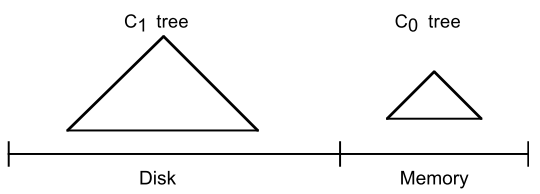
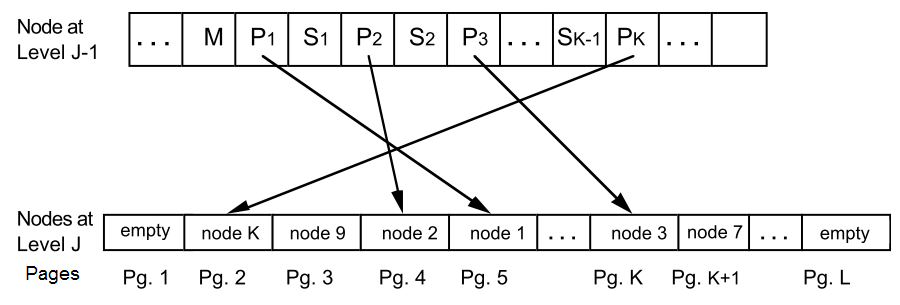

# 存储引擎

DAM(Disk-Access mode):
1. 一台机器有一个处理器、一个可以包含 M 个 objects 的内存以及无穷大小的外存
2. 在一次 I/O 操作中, 计算机可以在内存和外存之间传输包含 B objects 的 block, 其中 1 < B < M
3. 一个算法的 Running Time 可以定义为在算法执行期间 I/O 的次数、只用内存数据进行的计算可以认为是没有代价的
4. 一个数据结构的大小可以定义成可以包含它的 blocks 数的大小 

- 写放大: 实际写入磁盘的数据大小 和 程序要求写入数据大小 之比
- 读放大: 一次查询所需要的 I/O 数

## B-Tree

为磁盘和内存而优化

1. 对 B 树的写入过程是一次 **原位写入** 的过程
2. 主要分为两个部分, 首先是查找到对应的块的位置, 然后将新数据写入到刚才查找到的数据块中, 然后再查找到块所对应的磁盘物理位置, 将数据写入去
3. 在内存比较充足的时候, 因为 B 树的一部分可以被缓存在内存中, 所以查找块的过程有一定概率可以在内存内完成, 不过为了表述清晰, 我们就假定内存很小, 只够存一个 B 树块大小的数据吧
4. 可以看到, 在上面的模式中, 需要两次随机寻道(一次查找, 一次原位写), 才能够完成一次数据的写入, 代价很高

## LSM 树(Log-Structured Merge Tree)

代表数据库: nessDB, levelDB, HBase

核心思想: 通过 **批量存储** 技术规避磁盘随机写入问题, 放弃部分读能力

> 假定内存足够大, 不需要每次有数据就必须将数据写入到磁盘中, 可以将 *最新* 的数据驻留(hold)在内存中;
> 在积累到足够多后(达到 threadhold 后批量写入到磁盘), 通过 归并排序 将内存内的数据合并到磁盘队尾(rolling merge)

如果要最大化发挥磁盘的技术特性, 一次性的读取或写入固定大小的一块数据, 并尽可能的减少随机寻道操作的次数

特性:
- **批量写入, 存储延迟**
- 相比于 B-tree , 能显著地减少磁盘磁盘臂的开销, 并能在较长的时间内提供对文件的高速插入
- 在需要查询高速响应的时候性能不佳

适用于: 索引插入比检索更频繁的场景

#### 具体阐述

LSM-Tree 是由 两个或两个以上 存储数据的结构 组成的, 以两个部件为例:
- 一个部件常驻 内存 , 称为 C0 树(C0), 可以作为任何方便键值查找的数据结构
- 一个部件常驻 硬盘 , 称为 C1 树(C1), 其数据结构与 B-Tree 相似(C1 中经常被访问到的节点也会被缓存在内存中)

- 当插入一条新的数据条目后, 先向日志文件中写入插入操作的日志, 以备恢复
- 根据新条目的索引值将新条目插入到 C0 中
- 当C0 的大小达到阈值, 将一部分的条目从 C0 滚动合并到磁盘中的 C1 中
- C1 结构和 B-Tree 相似, 但其节点中的条目是满的, 节点的大小为 1 页, 树根之下的所有单页节点合并到地址连续的多页块中

#### LSM-Tree 优化方案

### Bloom filter

带随机概率的 Bitmap

### Compact 

## LSH 树()

## FractalTree

## Hash Map

特性:
- 支持 O(1) 的增删读写操作, 支持随机读写
- 不支持顺序读写, 不支持范围读写
