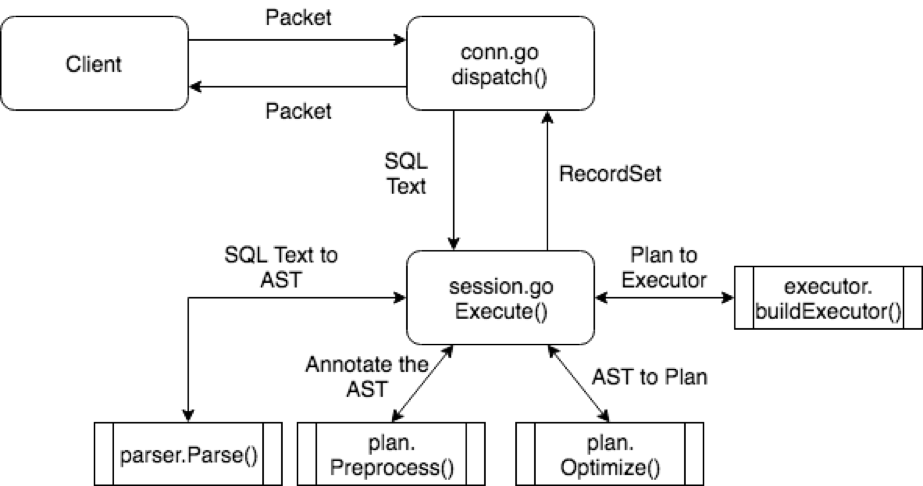
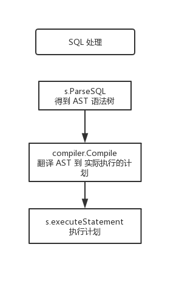

# TIDB

## 概念


- TiDB-Server:
  - 负责接收 SQL 请求, 处理 SQL 相关的逻辑, 并通过 PD 找到存储计算所需数据的 TiKV 地址, 与 TiKV 交互获取数据, 最终返回结果
  - TiDB 无状态, 本身不存储数据, 只负责计算
  - 可无限水平扩展, 可通过均衡负载组件(LVS/HAProxy/F5) 对外提供统一的接入地址
- PD-Server:
  - 集群管理模块
  - 存储集群的元数据
  - 对 TiKV 集群进行调度和负载均衡(数据迁移/Raft group leader 迁移)
  - 分配全局唯一且递增的事务 ID , 提供全局时钟服务
  - PD 通过 Raft 协议保证数据安全性; 因此建议部署奇数个 PD 节点
- TiKV-Server:
  - 分布式, 带事务的 Key-Value 存储引擎
  - 存储数据的基本单位是 Region, Region 负责存储一个 Key Range(从 StartKey 到 EndKey 的左闭右开区间)
  - 以 Raft 协议做复制, 保证数据一致性和容灾; 副本以 Region 为单位调度管理; 多个 Region 以 (?) 组成 Raft Group, 互为副本
- TiSpark
  - 用于解决复杂的 OLAP 需求, 将 Spark SQL 直接运行在 TiDB 存储层上

特性:
- 水平扩展:
  - 计算能力: TiDB
  - 存储能力: TiKV
  - 调度能力: PD

## TIDB

### 存储

- RocksDB: 存储引擎
- Raft: 分布式一致性
  - Leader 选举
  - 成员变更
  - 日志复制

TiKV 写数据到 RocksDB 的过程:


#### Region


- 对于一个 KV 系统, TiKV 以一个连续的 Key 组作为一个 Region , 保存在一个存储节点上
- Region 的规则规定:
  - 以 Region 为单位, 将数据分散在集群中所有的节点上, 并且尽量保证每个节点上服务的 Region 数量差不多
  - 以 Region 为单位做 Raft 的复制和成员管理

#### 事务 -- Percolator 模型

Percolator 的两阶段提交
- `Client.Set()` 数据仅被缓存, 而不做刷写
- 在第二阶段, 只要有一个 percolator 事务的 [primary row 的 lock 字段] 被清除并且 [write record] 写好(这两个动作是在同一个 bigtable 事务中原子完成的), 那么就认为事务提交成功

### 计算

#### 数据编码规则

每行数据的编码规则:

```shell
Key: tablePrefix{tableID}_recordPrefixSep{rowID}
Value: [col1, col2, col3, col4]
```

(Unique )Index 数据的编码规则:

```shell
Key: tablePrefix{tableID}_indexPrefixSep_indexID_indexedColumnsValue
Value: rowID
```

(Ununique ) Index 数据的编码规则:

```shell
Key: tablePrefix{tableID}_indexPrefixSep_indexID_indexedColumnsValue_rowID
Value: null
```

上文的部分源码:

```go
var(
	tablePrefix     = []byte{'t'}
	recordPrefixSep = []byte("_r")
	indexPrefixSep  = []byte("_i")
)
```


#### SQL 运算

认为 SQL 可以映射到 KV , 那么一般的 SQL 运算:
1. 构建 Key-Range: 由于表中的 RowID 都在 [0, MaxInt64) 这个范围; 用 0 和 MaxInt64 根据 Row 的 Key 编码规则, 就能构造出一个 [StartKey, EndKey) 的左闭右开区间
2. 扫描 Key-Range
3. 过滤数据
4. 计算 Count

优化:
- 为了减少 RPC 开销, 将计算往 存储节点 移


#### SQL 架构


### 调度

#### 调度需求

调度的基本要求:
- 副本数量不能多也不能少
- 副本需要分布在不同的机器上
- 新加节点后, 可以将其他节点上的副本迁移过来
- 节点下线后, 需要将该节点的数据迁移走

调度的优化需求:
- 维持整个集群的 Leader 分布均匀
- 维持每个节点的储存容量均匀
- 维持访问热点分布均匀
- 控制 Balance 的速度, 避免影响在线服务
- 管理节点状态, 包括手动上线/下线节点, 以及自动下线失效节点

#### 调度的基本操作(Raft)

- 增加一个 Replica(AddReplica)
- 删除一个 Replica(RemoveReplica)
- 将 Leader 角色在一个 Raft Group 的不同 Replica 之间 transfer(TransferLeader)

#### 信息收集

TiKV 集群定期向 PD 汇报

**每个 TiKV 节点会定期向 PD 汇报节点的整体信息**:
- 总磁盘容量
- 可用磁盘容量
- 承载的 Region 数量
- 数据写入速度
- 发送 / 接受的 Snapshot 数量(Replica 之间可能会通过 Snapshot 同步数据)
- 是否过载
- 标签信息(标签是具备层级关系的一系列 Tag)

**每个 Raft Group 的 Leader 会定期向 PD 汇报信息**:
- Leader 的位置
- Followers 的位置
- 掉线 Replica 的个数
- 数据写入 / 读取的速度

#### 调度策略

## SQL 流程

### 协议层




### SQL 处理



### 执行 SQL 计划

TiDB 的执行引擎是以 Volcano 模型运行的

如果以下 SQL 语句的执行计划

```sql
SELECT c1 FROM t WHERE c2 > 1;
```


#### Volcano Optimizer

基于成本(Cost)的优化算法

"成本最优假设" 认为, 如果一个方案是由几个局部区域组合而成, 各个局部 "相似" , 那么在计算总成本时, 我们只考虑每个局部目前已知的最优方案和成本即可


Calcite 实现的 Volcano Optimizer 支持以下三种终止条件:
- 时钟: 使用最大迭代计数或最大物理执行时间作为限制
- 成本阈值: 当优化方案的成本低于某个阈值是否结束算法(相比原始成本或固定值)
- 规则穷尽: 当无法再应用规则获得 新的关系代数结构 的时候结束算法

注意事项:
- 在最初的 Volcano Optimizer 论文中, 算法存在 逻辑优化 和 物理优化 两个步骤; 但是在后续的 Cascades 论文和 Calcite 的实现中, 逻辑变换的规则和物理变换的规则没有本质差别, 两者在一轮优化中同时使用, 以快速从 逻辑表示 转换为 物理执行
- Calcite 的 `Cost` 有 rows / IO / CPU 等字段, 但是计算依然以 rows 为基准, 因此需要考虑把其他方面的成本转换为行数
- 在关系代数树上查找 匹配的结构 是优化过程中最频繁的操作. Calcite 实现: 如果一个节点和每一匹配模式的根节点相互匹配, 则从该节点进行一次校验
- Calcite 默认并不进行枚举式优化方案计算, 而是结合启发式计算进行有限的搜索

各种优化方式:
- Vectorized Execution: 元素在关系代数节点之间的 获取批量化 以及利用 SIMD 指令集 优化, 借以提高 **并行性**
- Query Compilation: 通过 LLVM 等工具将优化后的执行方案编译成机器码
- 利用索引和物化视图

## Insert 概览

以以下语句为例

```sql
INSERT INTO t VAULES ("pingcap001", "pingcap", 3);
```

## TiDB 的异步 schema 变更实现

### 新概念

- 元数据记录: 为了简化设计, 引入 system database 和 system table 来记录异步 schema 变更过程中的一些元数据
- state: 根据 F1 的异步 schema 变更过程, 中间引入了一些状态, 该状态和 columns, index, table 和 database 绑定
  - 主要包括 none, delete-only, write-only, write-reorganization, public
  - 创建操作的状态与顺序相反(??), write-reorganization 改为 delete-reorganization
- Lease: 同时刻系统所有节点的 schema 最多只有 **两** 个不同版本
  - 一个租期内每个正常节点都主动加载 schema 信息; 如果不能租期内正常加载, 该节点自动退出系统
  - 即: **确保整个系统的所有节点都已经从某个状态更新到下个状态, 需要 2 倍的租期时间**
- Job: 每个单独的 DDL (Data Defined Language)操作都可看作一个 job
  - 在一个 DDL 操作开始时, 会将此操作封装成一个 job 并存放到 job queue, 等此操作完成时, 会将此 job 从 job queue 删除, 并在存入 history job queue, 便于查看历史 job
- Worker: 每个节点都有一个 worker 用于处理 job
- Owner
  - 一个独立的系统只有一个节点的 worker 能当选 owner
  - owner 角色有任期, owner 的信息会存储在 KV 层中, worker 定期获取 KV 层中的 owner 信息, 如果其中 ownerID 为空, 或者当前的 owner 超过了任期, 则 worker 可以尝试更新 KV 层中的 owner 信息(设置 ownerID 为自身的 workerID); 如果更新成功, 则该 worker 称为 owner
  - 这个用来确保整个系统同一时间只有一个节点在处理 schema 变更
- Background operations: 主要用于 delete reorganization 的优化处理; 总共引入了 background job, background job queue, background job history queue, background worker 和 background owner

## 附加

### 概念

- OLTP(联机事务处理/on-line transaction processing):
  - 强调数据库内存效率, 强调内存各种指标的命令率, 强调绑定变量, 强调并发操作
- OLAP(联机分析处理/On-Line Analytical Processing):
  - 强调数据分析, 强调 SQL 执行市场, 强调磁盘 I/O, 强调分区
- DW(数据仓库/Data-Warehouse):
  - 存储从 DB 截取出的视图
- ETL(数据清洗/Extraction-Transformation-Loading):
  - 用于完成 DB 到 DW 的数据转存
  - 一般的 DB 都是 ER 模型, 遵从范式化设计原则; DW 则是 面向主题/面向问题 的, 一般是 星型/雪花型, 两者模型结构不同
- DM(数据挖掘/Data Mining):
  - 根据统计学理论, 将 DW 中的数据进行分析, 找出不能直观发现的规律
- BI(商业智能):
  - 获取了 OLAP 的统计信息, 和 DM 得到的科学规律之后, 对生产进行适当的调整
