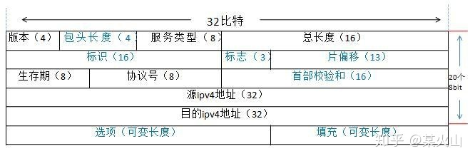

# TCP-IP

## 以太帧

`Preamble`：前导码，7 bytes，用于数据传输过程中的双方发送、接收的速率的同步

`SFD`：帧开始符，1 bytes，表明下一个字节开始是真实数据（目的MAC地址）

`dst MAC`：目的MAC地址，6 bytes，指明帧的接受者

`src MAC`：源MAC地址，6 bytes，指明帧的发送者

`Length`：长度，2 bytes，指明该帧数据字段的长度，但不代表数据字段长度能够达到（2^16）bytes

`Type`：类型，2 bytes，指明帧中数据的协议类型，比如常见的 IPv4 中 ip 协议采用 0x0800

`Data and Pad`：数据与填充，46~1500 bytes，包含了上层协议传递下来的数据，如果加入数据字段后帧长度不够 64 bytes，会在数据字段加入“填充”至达到 64 bytes

`FCS`：帧校验序列，4 bytes，对接收网卡（主要是检测Data and Pad字段）提供判断是否传输错误的一种方法，如果发现错误，丢弃此帧。目前最为流行的用于FCS的算法是循环冗余校验（cyclic redundancy check –CRC）

## IPV4

`Version`：版本，4 bits，用来表明IP协议实现的版本号，当前一般为 IPv4，即 0100 ，IPv6 的为 0110 。这个字段确保可能运行不同IP版本的的设备之间的兼容性

`IHL`：报头长度，4 bits，以 32 bits 的字来定义 IP 首部的长度，包括可选项。若该字段的值是 5 ，即 5*32 = 160 比特 = 20 字节。此字段最大值为 60(15*32/8=60)bytes
TOS：服务类型，8 bits，用于携带提供服务质量特征信息的字段，服务类型字段声明了数据报被网络系统传输时可以被怎样处理。其中 前 3 bit 为优先权子字段（Precedence，现已被忽略，各种终端都不采用）。第 8 bit 保留未用。第 4 至第 7 bit 分别代表延迟、吞吐量、可靠性和花费。当它们取值为 1 时分别代表要求最小时延、最大吞吐量、最高可靠性和最小费用。这 4 bit 的服务类型中只能置其中 1 比特为 1 。可以全为 0，若全为 0 则表示一般服务。大多数情况下该 TOS 会被忽略

`Total Length`：总长度，16 bits，指明整个数据报的长度，按字节为计算。最大长度为65535（2^16=65536）字节

`Identification`：标识，16 bits，用来唯一地标识主机发送的每一份数据报。IP软件会在存储器中维持一个计数器，每产生一个数据段，计数器就加 1，并将此值赋给标识字段。但这个“标识”并不是序号，因为IP是无连接服务，数据报不存在按序接收的问题。如数据报由于超过网络的MTU而必须分片时，这个标识字段的值就被复制到所有的数据报的标识字段中。相同的标识字段的值使分片后各数据报片最后能正确的重装成为原来的数据报

`Flags`：标志，3 bits，分别是（RF, DF, MF），目前只有DF, MF有效。DF（don't  fragment），置为 0 时表示可以分段，置为 1 是不能被分段；MF（more fragment），置为 0 时表示该数据段为最后一个数据段，置为 1 时表示后面还有被分割分段

`Fragment offset`：段偏移量，13 bits，指出较长的分组在分段后，某段在原分组的相对位置。也就是说相对用户字段的起点，该片从何处开始。段偏移以 8 个字节（有 3 位被 flags 占据）为偏移单位。这就是，每个分片的长度一定是 8 bytes( 64 bits ) 的整数倍

`Time to live`：生存期（TTL），8 bits，用来设置数据报最多可以经过的路由器数。由发送数据的源主机设置，通常为32、64、128等。每经过一个路由器，其值减1，直到0时该数据报被丢弃

`Protcol`：协议，8 bits，指明ip数据字段中的数据采用上层什么协议封装的。常见的有ICMP（1）、IGMP（2）、TCP（6）、UDP（17）

`Header Checksum`：头部校验和，16 bits，填充根据IP头部计算得到的校验和码。计算方法是：对头部中每个 16 bits 进行二进制反码求和，但不和涉及头部后的数据字段

`Source Address`：源ip地址，32 bits，如（192.168.1.2）

`Destination Address`：目的ip地址，32 bits，如（192.168.1.3）

`Option`：选项，n*32 bits。用来定义一些可选项：如记录路径、时间戳等。但这些选项很少被使用，同时并不是所有主机和路由器都支持这些选项。可选项字段的长度必须是 32bits 的整数倍，如果不足，必须填充0以达到此长度要求。根据IHL可以得到option的长度

`Data`：数据，不定长度，但受限于数据报的最大长度（65536/2^16 bytes）。这是在数据报中要传输的数据。它是一个完整的较高层报文或报文的一个分片

## TCP

`src port`：源端口，2 bytes，是一个大于 1023 的 16 位数字，由基于TCP应用程序的用户进程随机选择

`dst port`：目的端口，2 bytes，指明接收者所用的端口号，一般由应用程序来指定

`Sequence number`：顺序号，4 bytes，用来标识从 TCP 源端向 TCP 目的端发送的数据字节流，它表示在这个报文段中的第一个数据字节的顺序号。如果将字节流看作在两个应用程序间的单向流动，则 TCP 用顺序号对每个字节进行计数。序号是 32bit 的无符号数，序号到达 (2^32) － 1 后又从 0 开始。当建立一个新的连接时， SYN 标志变 1 ，顺序号字段包含由这个主机选择的该连接的初始顺序号 ISN （ Initial Sequence Number ）

`Acknowledgement number`：确认号，4 bytes，包含发送确认的一端所期望收到的下一个顺序号。因此，确认序号应当是上次已成功收到数据字节顺序号加 1 。只有 ACK 标志为 1 时确认序号字段才有效

`Offset`：报头长度，4 bits，给出报头中 32bit 字的数目n (**data 部之前的报文长度(32 * n)**)。需要这个值是因为任选字段的长度是可变的。这个字段占 4bits ， 即 TCP 最多有 60（15*4）bytes 的首部

`Resrvd`：保留区域，6 bits，保留给将来使用，目前必须置为 0

`Control Flags`（6 bits）控制位包括
- `URG`: 为 1 表示紧急指针有效，为 0 则忽略紧急指针值
- `ACK`: 为 1 表示确认号有效，为 0 表示报文中不包含确认信息，忽略确认号字段; **作为数据帧**
- `PSH`: 为 1 表示是带有 PUSH 标志的数据，指示接收方应该尽快将这个报文段交给应用层而不用等待缓冲区装满(一次作为完整通讯中的最后一帧)
- `RST`: 用于复位由于主机崩溃或其他原因而出现错误(error)的连接。它还可以用于拒绝非法的报文段和拒绝连接请求。一般情况下，如果收到一个 RST 为 1 的报文，那么一定发生了某些问题
- `SYN`: 同步序号，为 1 表示连接请求，用于建立连接和使顺序号同步（ synchronize ）
- `FIN`: 用于释放连接，为 1 表示发送方已经没有数据发送了，即关闭本方数据流

`Window Size`：窗口大小，2 bytes，表示从确认号开始，本报文的源方可以接收的字节数，即源方接收窗口大小。窗口大小是一个 16bit 字段，因而窗口大小最大为 65535（2^16 - 1）

`Checksum`：校验和，2 bytes，对整个的 TCP 报文段（包括 TCP 头部和 TCP 数据），以 16 位字进行计算所得。这是一个强制性的字段，要求由发送端计算和存储，并由接收端进行验证

`Urgent Pointer`：紧急指针，2 bytes，是一个正的偏移量，和顺序号字段中的值相加表示紧急数据最后一个字节的序号。 TCP 的紧急方式是发送端向另一端发送紧急数据的一种方式。 只有当URG 标志置 1 时紧急指针才有效

`Option and Pad`：选项和填充，n*4 bytes，常见的可选字段是最长报文大小 MSS(Maximum Segment Size) 。每个连接方通常都在通信的第一个报文段（为建立连接而设置 SYN 标志的那个段）中指明这个选项，它指明本端所能接收的最大长度的报文段。选项长度不一定是 32 bits 字的整数倍，所以要加 *填充位* ，使得报头长度成为整字数

`Data`：数据，不定长度，为上层协议封装好的数据

### Golang-TCPConn 相关设置

设置后的相关错误返回:
- SetDeadline                     -- io time out
- SetKeepAlive/SetKeepAlivePeriod -- read: connection timed out

## UDP

`src port`：源端口，2 bytes，是一个大于 1023 的 16 bits 数字，由基于UDP应用程序的用户进程随机选择。

`dst port`：目的端口，2 bytes，指明接收者所用的端口号，一般由应用程序来指定

`Length`：数据长度，2 bytes，指明了包括首部在内的UDP报文段长度

`Checksum`：检验和，2 bytes，指整个UDP报文头和UDP所带的数据的校验和（也包括伪报文头）。伪报文头不包括在真正的UDP报文头中，但是它可以保证UDP数据被正确的主机收到了

`Data`：数据字段，不定长度，为上层协议封装好的数据
