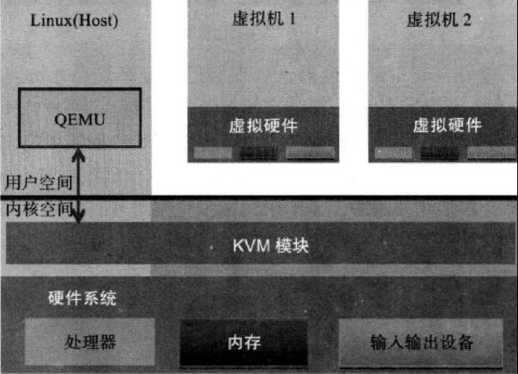

# KVM

## KVM 介绍

### 简单介绍

- 基于虚拟化扩展(*Intel VT* OR *AMD-V*)的 X86 硬件的 Linux 原生的全虚拟化解决方案
- 通过 /dev/kvm 接口设置一个客户端虚拟服务器的地址空间 并提供模拟 I/O

- Guset: 客户端系统, 提供 CPU(VCPU), 内存, 驱动; 被 KVM 置于一种受限制的 CPU 模式下运行
- KVM: 内核驱动, 提供 CPU 和 内存 的虚机化, 客户端的 I/O 拦截
- QEMU: 用户进程, 专供 KVM 虚机使用的 QEMU, Guest 的 I/O 被 KVM 拦截后, 将会最终由 QEMU 处理; 提供给 Guset 虚拟的硬件 I/O, 通过 IOCTL /dev/kvm 设备与 KVM 交互

### KVM 功能列表

- 支持 CPU 和 menory 超分 (Overcommit)
- 支持半虚拟化 I/O
- 支持热插拔(CPU, 块设备, 网络设备)
- 支持对称多处理器(SMP 架构)
- 支持实时迁移(Live Migration)
- 支持 PCI 设备直接分配和单根 I/O 虚拟化(SR-IOV)
- 支持内核同页合并(KSM)
- 支持 NUMA (非一致存储访问结构)

### KVM 工具

- libvirt: 操作/管理 KVM 虚机的虚拟化 API, 可操作 KVM vmware XEN Hyper-V LXC 等多重 Hypervisor
- Virsh: 基于 libvirt 的 CLI
- Virt-Manager: 基于 libvirt 的 GUI
- Virt-V2V: 虚机格式迁移工具
- Virt-install ...
- sVirt: 安全工具

## CPU 和内存虚拟化

### 为什么需要 CPU 虚拟化

X86 操作系统默认运行在 Ring0 的 CPU 级别上, 但是虚拟操作系统不知道, 此时, 需要 VMM(虚拟机管理程序) 来避免这种情况 -- 虚机通过 VMM 的以下方法访问硬件:

- 半虚拟化
- 全虚拟化
- 硬件辅助的虚拟化

### 基于二进制翻译的全虚拟化

客户端操作系统(Guest OS) 运行在 Ring 1, 当它在执行特权指令(Ring 0)时, 触发异常, VMM 捕获该异常, 在异常里翻译, 模拟, 最终返回给 Guest OS

该流程性能损耗大

### 超虚拟化(半虚拟化/操作系统辅助虚拟化)

通过修改操作系统内核, 替换不能虚拟化的指令, 通过**超级调用(hypercall)** 直接和底层的 **虚拟化层(hypervisor)** 通讯
hypervisor 同时也提供 **超级调用接口** 满足其他关键内核操作, 如*内存管理*, *中断*, *时间保持*

该流程不需要捕获和模拟, 性能损耗低

该流程只适用于 linux , 不适用于 Windows

### 硬件辅助的全虚拟化

Intel 和 AMD 的虚拟化技术

#### Intel-VT(Virtualization Technology)

该技术下 VMM 运行在 VMX root operation , 客户端 OS 运行在 VMX non-root operation

VM-entry: VMX root operation 通过调用 **VMLAUNCH/VMRESUME** 指令切换到 VMX non-root operation
VM-exit: 调用 **VMCALL** 指令调用 VMM 服务, 硬件挂起 Guest OS, 切换到 VMX root operation
