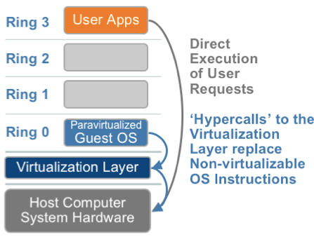
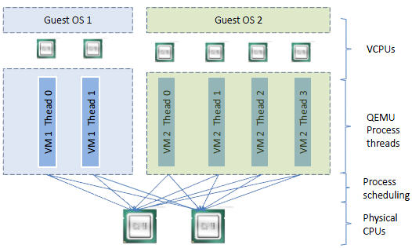
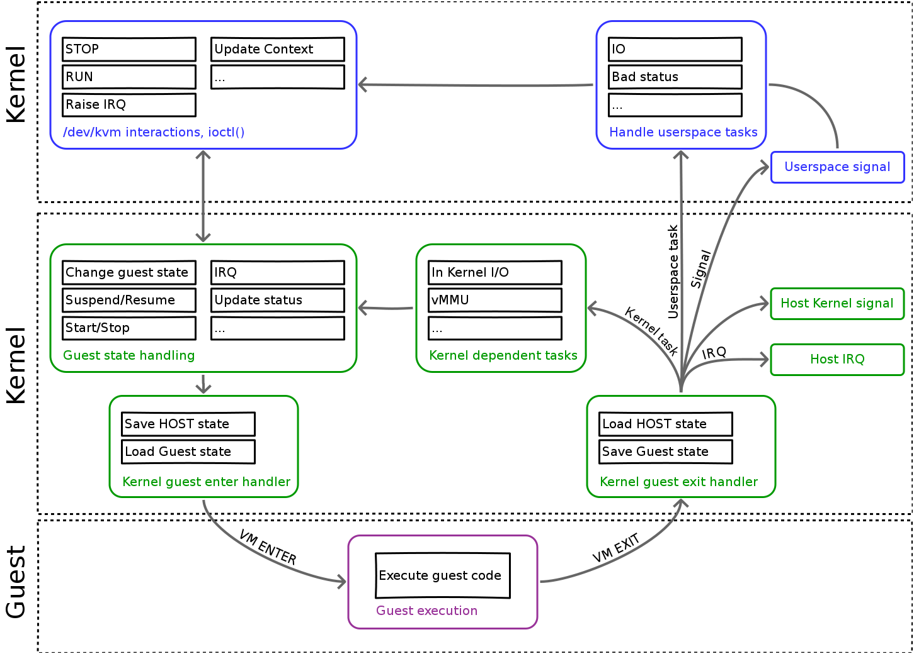

# KVM

## KVM 介绍

### 简单介绍

- 基于虚拟化扩展(*Intel VT* OR *AMD-V*)的 X86 硬件的 Linux 原生的全虚拟化解决方案
- 通过 /dev/kvm 接口设置一个客户端虚拟服务器的地址空间 并提供模拟 I/O

- Guset: 客户端系统, 提供 CPU(VCPU), 内存, 驱动; 被 KVM 置于一种受限制的 CPU 模式下运行
- KVM: 内核驱动, 提供 CPU 和 内存 的虚机化, 客户端的 I/O 拦截
- QEMU: 用户进程, 专供 KVM 虚机使用的 QEMU, Guest 的 I/O 被 KVM 拦截后, 将会最终由 QEMU 处理; 提供给 Guset 虚拟的硬件 I/O, 通过 IOCTL /dev/kvm 设备与 KVM 交互

### KVM 功能列表

- 支持 CPU 和 menory 超分 (Overcommit)
- 支持半虚拟化 I/O
- 支持热插拔(CPU, 块设备, 网络设备)
- 支持对称多处理器(SMP 架构)
- 支持实时迁移(Live Migration)
- 支持 PCI 设备直接分配和单根 I/O 虚拟化(SR-IOV)
- 支持内核同页合并(KSM)
- 支持 NUMA (非一致存储访问结构)

### KVM 工具

- libvirt: 操作/管理 KVM 虚机的虚拟化 API, 可操作 KVM vmware XEN Hyper-V LXC 等多重 Hypervisor
- Virsh: 基于 libvirt 的 CLI
- Virt-Manager: 基于 libvirt 的 GUI
- Virt-V2V: 虚机格式迁移工具
- Virt-install ...
- sVirt: 安全工具

## CPU 和内存虚拟化

### 为什么需要 CPU 虚拟化

X86 操作系统默认运行在 Ring0 的 CPU 级别上, 但是虚拟操作系统不知道, 此时, 需要 VMM(虚拟机管理程序) 来避免这种情况 -- 虚机通过 VMM 的以下方法访问硬件:

- 半虚拟化
- 全虚拟化
- 硬件辅助的虚拟化

### 基于二进制翻译的全虚拟化

客户端操作系统(Guest OS) 运行在 Ring 1, 当它在执行特权指令(Ring 0)时, 触发异常, VMM 捕获该异常, 在异常里翻译, 模拟, 最终返回给 Guest OS

该流程性能损耗大

### 超虚拟化(半虚拟化/操作系统辅助虚拟化)

通过修改操作系统内核, 替换不能虚拟化的指令, 通过**超级调用(hypercall)** 直接和底层的 **虚拟化层(hypervisor)** 通讯
hypervisor 同时也提供 **超级调用接口** 满足其他关键内核操作, 如*内存管理*, *中断*, *时间保持*

该流程不需要捕获和模拟, 性能损耗低

该流程只适用于 linux , 不适用于 Windows

|                           | 利用二进制翻译的全虚拟化               | 硬件辅助虚拟化                                                                       | 操作系统协助/半虚拟化                                                                                           |
| --                        | --                                     | --                                                                                   | --                                                                                                              |
| 实现技术                  | BT 和直接执行                          | 遇到特权指令转到 root 模式执行                                                       |                                                                                                                 |
| 客户端操作系统修改/兼容性 | 无需修改客户操作系统, 最佳兼容性       | 无需修改客户操作系统, 最佳兼容性                                                     | 客户操作系统需要修改来支持 hypercall , 因此不能运行在物理硬件本身和其他 Hypervisor 上, 兼容性差, 不支持 Windows |
| 性能                      | 差                                     | 全虚拟化下, CPU 需要在两种模式之间切换, 带来性能开销; 但是, 其性能在逐渐毕竟半虚拟化 | 好 半虚拟化下 CPU 性能开销几乎为 0, 虚机性能接近于物理机                                                        |
| 应用厂商                  | VMWare Workstation / QEMU / Virtual PC | VMware ESXi / Microsoft Hyper-V / Xen 3.0 / KVM                                      | Xen                                                                                                             |

### 硬件辅助的全虚拟化

Intel 和 AMD 的虚拟化技术

#### Intel-VT(Virtualization Technology)

该技术下 VMM 运行在 VMX root operation , 客户端 OS 运行在 VMX non-root operation

VM-entry: VMX root operation 通过调用 **VMLAUNCH/VMRESUME** 指令切换到 VMX non-root operation
VM-exit: 调用 **VMCALL** 指令调用 VMM 服务, 硬件挂起 Guest OS, 切换到 VMX root operation

### SMP MPP NUMA

#### SMP

多处理器架构

所有 CPU 共享全部资源(总线, 内存, IO 系统等) 操作系统或数据库只有一个副本

多个 CPU 之间没有区别, 平等的访问内存 外设 唯一一个操作系统

扩展能力有限, SMP 服务器 CPU 利用率最好在 2 到 4 个 CPU

#### MPP

海量并行处理结构: 分布式存储器模式

一个分布式存储器模式, 具有多个节点, 每个节点都有自己的(不共享的)存储器

能配置为 SMP 结构, 也能配置为非 SMP 结构

MPP 能理解为单一 SMP 的横向扩展集群, 需要软件实现

#### NUMA

非一致存储访问结构

由多个 SMP 服务器通过一定的节点以**互联网**的形式连接, 协同工作, 从用户的角度是一个完整的服务器系统

多个 SMP 系统通过节点互联网连接而成, 每个节点都只访问自己的本地资源(内存, 存储等), 是一种完全 **无共享(Share Nothing)** 结构

### KVM 的 CPU 虚拟化

1. qemu-kvm 通过对 /dev/kvm 的一系列 IOCTL 命令操作虚机

2. 一个 KVM 虚机即一个 Linux qemu-kvm 进程, 与其他 Linux 进程一样被 Linux 进程调度器调度

3. KVM 户级系统的内存是 qemu-kvm 进程的地址空间的一部分

4. KVM 虚机的 vCPU 作为进程运行在 qemu-kvm 进程的上下文中

### CPU 虚拟化

- 对于客户机, OS 运行在 ring 0 中, 应用运行在 ring 3 中
- 对于 KVM, QEMU 运行在 ring 3 中, KVM 运行在 ring 0 中

- QEMU 仅通过 KVM 控制虚机的代码被 CPU 执行, 本身不执行客户机代码
- 即, CPU 没有被虚级化成虚拟的 CPU 供客户机

上图部分概念:
- socket - 颗 - CPU 的物理单位
- core - 核 - 每个 CPU 的物理内核
- thread - 超线程 - CPU 核的虚拟化, 导致生成多个逻辑 CPU, 同时运行(有缺陷的)多线程

在 KVM 等虚拟化平台中, 会在 VM 层和物理层之间加入 VMKernel 层, 从而允许所有的 VM 共享物理层资源

- VM 层
- 物理层
- VMKernel 层

### 执行客户机系统代码

Linux 内核的执行模式
- 用户模式 - User -- 代表客户机系统执行 I/O 操作
- 内核模式 - Kernel -- 负责将 CPU 切换到 Guest Mode 执行 Guest OS 代码, 并在 CPU 退出时回到 Kernel 模式
- 客户机模式 - Guest - KVM 驱动为 **支持虚拟化的 CPU** 而添加 -- 执行客户机系统非 I/O 代码, 同时在需要的时间驱动 CPU 退出该模式

KVM 内核驱动作为 User mode 和 Guest mode 之间的桥梁
- **User Mode** 中的 Qemu-KVM 通过 IOCTL 运行虚拟机
- KVM 内核模块收到请求后, 将 VCPU 上下文加载到 **VMCS(virtual machine control structure)** ,驱动 CPU 进入 VMX non-root 模式, 执行 客户机代码

QEMU-KVM 相比原生 QEMU 的改动
- 原生 QEMU 通过 **指令翻译** 实现 CPU 虚拟化; 修改后的 QEMU-KVM 则通过 IOCTL 调用 KVM 模块
- 原生 QEMU 时单线程, QEMU-KVM 时多线程

一个 QEMU 进程的线程任务
- I/O 线程 -- 管理模拟设备
- vCPU 线程 -- 运行 Guest 代码
- 其他如 Event Loop, Offloaded Tasks

### 客户机线程到物理 CPU

- 客户机线程调度到客户机物理 CPU(KVM vCPU)
- vCPU 线程调度到主机物理 CPU, 由 Hypervisor(Linux) 负责

Linux 进程调度

- Linux 进程将一个 可运行(runnable)进程(依靠 CPU 亲和性规则)调度
- 处理器亲和性: 可设置 vCPU 在指定的物理 CPU 上运行
- vCPU 数目不超过物理 CPU 数, 否则, 会出现线程间 CPU 内核资源竞争

### 客户端 vCPU 分配规则

1. 根据负载需要分配最少 vCPU
2. 客户机 vCPU 总数不应超过物理 CPU 内核总数, 否则, 存在 CPU 竞争, CPU 核内线程切换, 导致 overhead
3. 负载分为 计算负载和 I/O 负载; 对于计算负载, 需要分配较多 vCPU, 甚至需要考虑 CPU 亲和性

### KVM 内存虚拟化

利用 mmap 系统调用, 在 QEMU 主线程的虚拟地址空间中模拟 MMU 

- VA->PA -- *客户机虚拟地址* 到 *客户机内存物理地址* 的映射
- PA->MA -- VMM 负责的 *客户物理内存* 到 *实际机器内存* 的映射

VMM 内存虚拟化:
- 软件方式 -- 内存地址翻译, Shadow page table
- 硬件实现 -- 基于 CPU 的辅助虚拟化, AMD-NPT(Nested Page Tables) 和 Intel-EPT(Extended Page Tables)

EPT 硬件辅助虚拟化:
- Guest Physical Address -> System Physical Address, VMM 不需要保留 SPT(Shadow Page Table), 不经过 SPT 转换过程
- 能耗低, 硬件指令集更可靠和稳定

